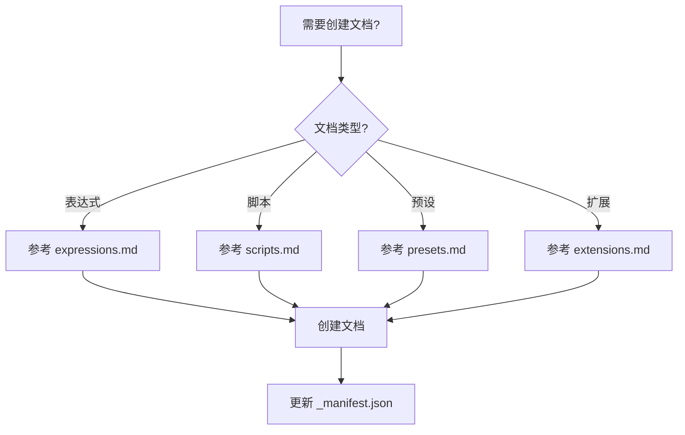

# 文档编写技能

## 概述

为 AE 脚本市场内容系统创建文档。

**核心规则：**
- 统一的元数据格式
- 正确的目录和图片路径
- 网络地址作为下载链接
- 更新对应的 _manifest.json

**必需前置技能：** 使用 `superpowers:test-driven-development` 确保文档质量

## 工作流程



## 标准元数据（必须）

所有文档必须包含以下 YAML 前置元数据：

```yaml
---
title: 文档标题
iconEmoji: 🔧
author: 烟囱鸭
tags: [标签1, 标签2, 标签3]
description: 简短副标题
updatedAt: YYYY-MM-DD
---
```

## 目录结构

```
public/content/
├── expressions/
│   ├── _manifest.json
│   ├── *.md
│   └── assets/          # 图片资源
├── scripts/
│   ├── _manifest.json
│   ├── *.md
│   └── assets/
├── presets/
│   ├── _manifest.json
│   ├── *.md
│   └── assets/
└── extensions/
    ├── _manifest.json
    ├── *.md
    └── assets/
```

## 子文档

- **expressions.md** - 表达式文档要点
- **scripts.md** - 脚本文档要点
- **presets.md** - 预设文档要点
- **extensions.md** - 扩展文档要点
- **shared/image-resources.md** - 图片资源管理
- **shared/download-links.md** - 下载链接规范
- **examples/** - 文档示例（参考）

## 核心规则（必须）

### 1. 图片路径

**规则：** 图片使用相对路径 `./assets/filename.png`

```markdown
✅ 
❌ 
```

### 2. 下载链接

**规则：** 使用网络地址，不使用本地路径

```markdown
✅ 🔗 [下载](https://github.com/.../file.ext)
❌ 🔗 [下载](/downloads/file.ext)
```

### 3. 清单更新

**规则：** 在对应目录的 `_manifest.json` 数组中添加文件名

```json
["existing-doc.md", "new-doc.md"]
```

## 快速参考

| 文档类型 | 参考文档 | 示例文件 |
|----------|----------|----------|
| 表达式 | expressions.md | examples/expression-example.md |
| 脚本 | scripts.md | examples/script-example.md |
| 预设 | presets.md | examples/preset-example.md |
| 扩展 | extensions.md | examples/extension-example.md |

## 参考资源

- **shared/image-resources.md** - 图片资源管理
- **shared/download-links.md** - 下载链接规范
- **examples/** - 文档示例（参考，非模板）

## 质量检查（必须）

- [ ] 元数据包含所有 6 个必需字段
- [ ] 文件保存在正确的 `public/content/{模块类型}/` 目录
- [ ] 下载链接使用网络地址
- [ ] 图片使用相对路径 `./assets/`
- [ ] 已更新对应的 `_manifest.json`

## 参考示例

查看现有文档：
- `public/content/expressions/auto-keyframe.md`
- `public/content/scripts/script-complete-guide.md`
- `public/content/presets/animation.md`
- `public/content/extensions/extension-dev-guide.md`