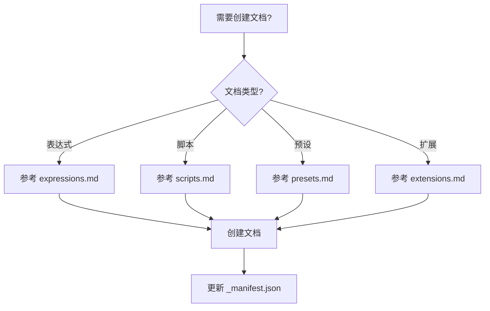

# 文档编写技能

## 概述

为 AE 脚本市场内容系统创建符合规范的文档，包含标准元数据、模块化内容结构和自动清单更新。

**核心原则：** 所有文档必须遵循统一的元数据格式、目录结构和清单更新流程。

**必需前置技能：** 使用 `superpowers:test-driven-development` 确保文档质量

## 何时使用



**使用场景：**
- 需要为表达式编写使用文档
- 需要为脚本编写功能说明
- 需要为预设编写效果展示
- 需要为扩展编写安装指南

**不使用场景：**
- 项目特定的技术文档（使用 CLAUDE.md）
- 一次性解决方案说明
- 不需要清单更新的简单文档

## 子文档

根据不同的文档类型，参考对应的子文档：

- **expressions.md** - 表达式文档编写
- **scripts.md** - 脚本文档编写
- **presets.md** - 预设文档编写
- **extensions.md** - 扩展文档编写

## 标准元数据

所有文档必须包含以下 YAML 前置元数据：

```yaml
---
title: 文档标题
iconEmoji: 🔧
author: 烟囱鸭
tags: [标签1, 标签2, 标签3]
description: 简短副标题
updatedAt: YYYY-MM-DD
---
```

**字段说明：**
- `title`：清晰描述的标题
- `iconEmoji`：代表内容的单个 emoji
- `author`：固定为 "烟囱鸭"
- `tags`：3-5 个相关标签（数组）
- `description`：一句话副标题
- `updatedAt`：ISO 日期格式 (YYYY-MM-DD)

## 目录结构

```
public/content/
├── expressions/      # 表达式
│   ├── _manifest.json
│   └── *.md
├── scripts/          # 脚本
│   ├── _manifest.json
│   └── *.md
├── presets/          # 预设
│   ├── _manifest.json
│   └── *.md
└── extensions/       # 扩展
    ├── _manifest.json
    └── *.md
```

## 清单更新

创建任何文档后，必须更新对应目录下的 `_manifest.json`。

**清单格式**：简单的字符串数组，包含所有文档文件名

**示例：**
```json
["auto-keyframe.md", "advanced-guide.md", "new-expression.md"]
```

**更新流程：**
1. 读取对应目录的 `_manifest.json`
2. 在数组中添加新文档文件名
3. 将更新后的数组写回文件
4. 保持 JSON 格式有效性（字符串数组）

## 通用内容要求

### Markdown 元素

根据内容使用适当的 Markdown 元素：
- **代码块** - 带语法高亮的代码
- **表格** - 功能对比
- **Mermaid 图表** - 流程图和流程
- **列表** - 有序/无序步骤
- **引用块** - 注意和警告
- **图片** - 免费资源图片

### 免费图片资源

按需使用这些免费图片源：
- **Unsplash**：`https://source.unsplash.com/featured/{关键词}`
- **Placeholder.com**：`https://via.placeholder.com/{宽}x{高}`
- **Iconify**：`https://icon-sets.iconify.design/{集合}/{图标}/`

**示例：**
```markdown

```

## 分析工作流程

### 提供文件时：

1. **分析提供的文件**（代码、脚本、预设）
2. **提取关键信息**：
   - 主要目的和功能
   - 使用场景
   - 技术原理
   - 关键特性
3. **根据模块类型生成文档**
4. **在正确目录创建文档**
5. **更新清单**

### 提供简单说明时：

1. **如有需要，澄清需求**
2. **研究主题**（如果不熟悉）
3. **生成综合文档**
4. **遵循模块特定结构**
5. **包含有用的图表/图表**
6. **创建文档并更新清单**

## 常见错误

| 错误 | 修正 |
|------|------|
| 缺少前置元数据字段 | 始终包含所有 6 个必需字段 |
| 目录错误 | 使用 `public/content/{模块类型}/` |
| 未更新清单 | 创建文档后始终更新 `_manifest.json` |
| iconEmoji 中缺少 emoji | 使用单个 emoji，不是文本 |
| 标签太通用 | 使用具体的、相关的标签（3-5 个） |
| 没有视觉元素 | 在适当的地方添加图表、图表或图片 |

## 通用质量检查清单

完成任何文档前检查：

- [ ] 前置元数据包含所有 6 个必需字段
- [ ] 文件保存在正确的 `public/content/{模块类型}/` 目录中
- [ ] 遵循模块特定结构
- [ ] 顶部有下载链接/代码块
- [ ] 包含使用场景
- [ ] 包含原理分析
- [ ] 在有帮助的地方包含视觉元素（图表/图片）
- [ ] 使用新项目更新 `_manifest.json`
- [ ] JSON 格式有效
- [ ] 适当地使用免费图片资源

## 快速参考

| 操作 | 步骤 |
|------|------|
| 创建表达式文档 | 1. 参考 expressions.md<br>2. 创建 `.md` 文件<br>3. 更新 `expressions/_manifest.json` |
| 创建脚本文档 | 1. 参考 scripts.md<br>2. 创建 `.md` 文件<br>3. 更新 `scripts/_manifest.json` |
| 创建预设文档 | 1. 参考 presets.md<br>2. 创建 `.md` 文件<br>3. 更新 `presets/_manifest.json` |
| 创建扩展文档 | 1. 参考 extensions.md<br>2. 创建 `.md` 文件<br>3. 更新 `extensions/_manifest.json` |

## 常见错误

| 错误 | 原因 | 修正方法 |
|------|------|----------|
| 缺少元数据字段 | 忘记添加 YAML 前置 | 添加完整的 6 个必需字段 |
| 目录错误 | 放错模块类型目录 | 使用 `public/content/{模块类型}/` |
| 未更新清单 | 创建文档后忘记更新 | 在 `_manifest.json` 数组中添加文件名 |
| iconEmoji 错误 | 使用文本而非 emoji | 使用单个 emoji 图标 |
| 标签不相关 | 标签过于通用 | 使用 3-5 个具体的、相关的标签 |
| 缺少视觉元素 | 只有文字没有图表 | 添加 Mermaid 图表或免费图片 |

## 参考示例

查看现有文档作为参考：
- **表达式**：`public/content/expressions/auto-keyframe.md`
- **脚本**：`public/content/scripts/script-complete-guide.md`
- **预设**：`public/content/presets/animation.md`
- **扩展**：`public/content/extensions/extension-dev-guide.md`