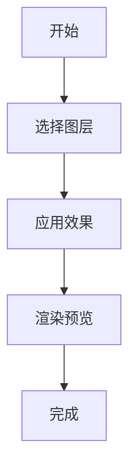
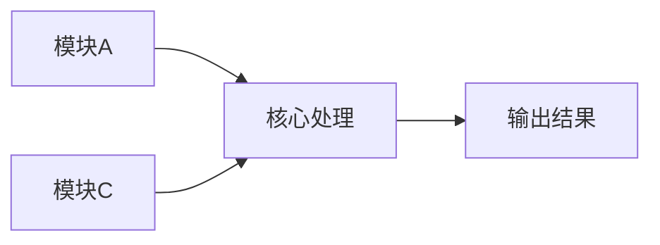

## 下载

🔗 [下载脚本](https://github.com/yancongya/AE----/releases/download/v1.0.0/script-name.jsx)

**文件信息：**
- 文件大小：1.2 MB
- 版本：v1.0.0
- 兼容性：AE CC 2019+
- 类型：自动化脚本

## 使用场景

- 场景 1：详细描述和效果
- 场景 2：详细描述和效果
- 场景 3：详细描述和效果

## 功能特性

### 核心功能

| 功能 | 说明 | 快捷键 |
|------|------|--------|
| 功能 1 | 详细说明 | Ctrl+1 |
| 功能 2 | 详细说明 | Ctrl+2 |

### 高级功能

- 高级功能 1：详细说明
- 高级功能 2：详细说明

## 原理分析

### 架构设计

[解释脚本的整体设计思路]

### 关键函数

#### 函数名 1

```javascript
function functionName1(param) {
  // 代码说明
}
```

**说明：** 函数的具体作用和用法

#### 函数名 2

```javascript
function functionName2(param) {
  // 代码说明
}
```

**说明：** 函数的具体作用和用法

### 数据流程

[解释数据如何流动和处理]

## 可视化指南

### 工作流程



### 功能关系



## 界面展示


## 使用教程

### 步骤 1：安装

1. 下载脚本文件
2. 复制到 AE 脚本目录
3. 重启 After Effects


### 步骤 2：运行

1. 打开 After Effects
2. 选择 Window → 脚本名称
3. 按需配置参数
4. 点击运行


### 步骤 3：配置

[详细的配置说明]


## 注意事项

> ⚠️ **注意**：重要的使用提示和限制

## 常见问题

### Q: 问题 1？

**A:** 详细解答

### Q: 问题 2？

**A:** 详细解答

## 更新日志

- v1.0.0 (2026-02-05)：初始版本