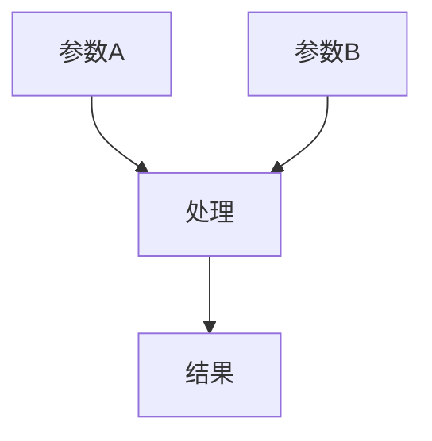

# 表达式文档编写

## 概述

为 After Effects 表达式创建符合规范的文档，重点突出可复制代码、使用场景和原理分析。

## 文档结构

```markdown
---
title: 表达式名称
iconEmoji: 📐
author: 烟囱鸭
tags: [表达式, 动画, 数学]
description: 用于平滑动画的强大表达式
updatedAt: 2026-02-05
---

## 表达式代码

```javascript
// 点击复制
value = ease(time, 0, 1, inPoint, outPoint);
```

## 使用场景

- 平滑关键帧过渡
- 缓入/缓出动画
- 运动图形时间控制

## 原理分析

[从内部解释表达式如何工作]

## 示例

[使用 markdown 包含图表、图表或视觉示例]
```

## 关键要素

### 1. 可复制代码块

- 放在文章顶部
- 添加 "// 点击复制" 注释
- 代码语法高亮（JavaScript）
- 保持代码简洁可读

### 2. 使用场景

- 列举 3-5 个典型应用场景
- 使用无序列表
- 描述清晰具体
- 适合不同技术水平

### 3. 原理分析

- 解释表达式的工作机制
- 分析关键函数和参数
- 说明输入输出关系
- 适当使用图表辅助说明

### 4. 实用示例

- 提供完整的使用示例
- 包含参数说明
- 展示不同参数效果
- 使用对比表格

## 内容模板

```markdown
## 表达式代码

```javascript
// 点击复制
expression_code_here
```

## 使用场景

- **场景 1**：详细描述
- **场景 2**：详细描述
- **场景 3**：详细描述

## 原理分析

### 工作原理

[解释表达式的基本原理]

### 关键参数

| 参数 | 类型 | 说明 | 示例值 |
|------|------|------|--------|
| param1 | 类型 | 说明 | 示例 |
| param2 | 类型 | 说明 | 示例 |

## 实用示例

### 示例 1：基本用法

```javascript
// 代码示例
```

### 示例 2：高级用法

```javascript
// 代码示例
```

## 注意事项

> ⚠️ **注意**：重要的使用提示

## 相关表达式

- [表达式名称 1](./another-expression.md)
- [表达式名称 2](./another-expression-2.md)
```

## 图表使用

### 流程图（Mermaid）


### 参数关系图



## 质量检查

- [ ] 顶部有可复制代码块
- [ ] 代码有 "// 点击复制" 注释
- [ ] 至少 3 个使用场景
- [ ] 原理分析清晰完整
- [ ] 包含实用示例
- [ ] 参数说明表格完整
- [ ] 有注意事项提示
- [ ] 包含相关表达式链接
- [ ] 已更新 `public/content/expressions/_manifest.json`

## 参考示例

查看现有表达式文档：
- `public/content/expressions/auto-keyframe.md`
- `public/content/expressions/advanced-guide.md`