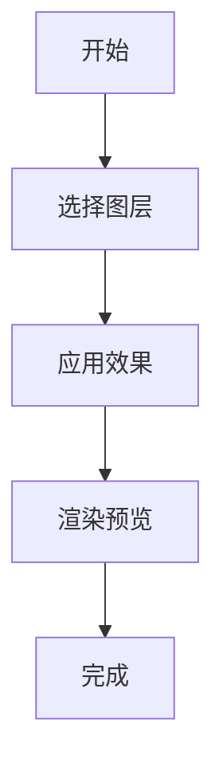
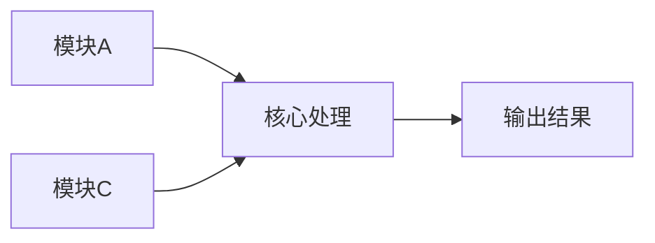

# 脚本文档编写

## 概述

为 After Effects 脚本创建符合规范的文档，重点突出下载链接、功能特性、原理分析和可视化指南。

## 文档结构

```markdown
---
title: 脚本名称
iconEmoji: 📜
author: 烟囱鸭
tags: [脚本, 自动化, 工具]
description: 在 After Effects 中自动化重复任务
updatedAt: 2026-02-05
---

## 下载

🔗 [下载脚本](/downloads/script-name.jsx)

## 使用场景

- 批量处理图层
- 自动化合成设置
- 自定义工作流工具

## 功能特性

- **功能 1**：详细描述
- **功能 2**：详细描述
- **功能 3**：详细描述

## 原理分析

[解释脚本架构和关键函数]

## 可视化指南

[包含流程图、图表或 UI 截图]
```

## 关键要素

### 1. 下载链接

- 放在文章顶部
- 使用明显的 emoji 图标
- 链接到实际下载文件
- 文件命名清晰规范

### 2. 使用场景

- 列举 3-5 个典型应用场景
- 描述具体的使用环境
- 说明解决的问题
- 适合不同用户需求

### 3. 功能特性

- 列出主要功能点
- 每个功能详细说明
- 按重要程度排序
- 突出独特优势

### 4. 原理分析

- 解释脚本的整体架构
- 分析关键函数和算法
- 说明数据处理流程
- 适当使用流程图

### 5. 可视化指南

- 工作流程图
- 功能关系图
- UI 界面截图
- 参数配置图表

## 内容模板

```markdown
## 下载

🔗 [下载脚本](/downloads/script-name.jsx)

**文件信息：**
- 文件大小：1.2 MB
- 版本：v1.0.0
- 兼容性：AE CC 2019+

## 使用场景

- **场景 1**：详细描述和效果
- **场景 2**：详细描述和效果
- **场景 3**：详细描述和效果

## 功能特性

### 核心功能

| 功能 | 说明 | 快捷键 |
|------|------|--------|
| 功能 1 | 详细说明 | Ctrl+1 |
| 功能 2 | 详细说明 | Ctrl+2 |

### 高级功能

- **高级功能 1**：详细说明
- **高级功能 2**：详细说明

## 原理分析

### 架构设计

[解释脚本的整体设计思路]

### 关键函数

#### 函数名 1

```javascript
function functionName1(param) {
  // 代码说明
}
```

**说明：** 函数的具体作用和用法

#### 函数名 2

```javascript
function functionName2(param) {
  // 代码说明
}
```

**说明：** 函数的具体作用和用法

### 数据流程

[解释数据如何流动和处理]

## 可视化指南

### 工作流程



### 功能关系



## 使用教程

### 步骤 1：安装

1. 下载脚本文件
2. 复制到 AE 脚本目录
3. 重启 After Effects

### 步骤 2：运行

1. 打开 After Effects
2. 选择 Window → 脚本名称
3. 按需配置参数
4. 点击运行

### 步骤 3：配置

[详细的配置说明]

## 注意事项

> ⚠️ **注意**：重要的使用提示和限制

## 常见问题

### Q: 问题 1？

**A:** 详细解答

### Q: 问题 2？

**A:** 详细解答

## 更新日志

- **v1.0.0** (2026-02-05)：初始版本
```

## 质量检查

- [ ] 顶部有下载链接
- [ ] 包含文件信息（大小、版本、兼容性）
- [ ] 至少 3 个使用场景
- [ ] 功能特性完整详细
- [ ] 原理分析清晰
- [ ] 包含关键函数代码
- [ ] 有可视化流程图
- [ ] 使用教程步骤清晰
- [ ] 有注意事项提示
- [ ] 包含常见问题解答
- [ ] 有更新日志
- [ ] 已更新 `public/content/scripts/_manifest.json`

## 参考示例

查看现有脚本文档：
- `public/content/scripts/script-complete-guide.md`
- `public/content/scripts/shape-morpher.md`