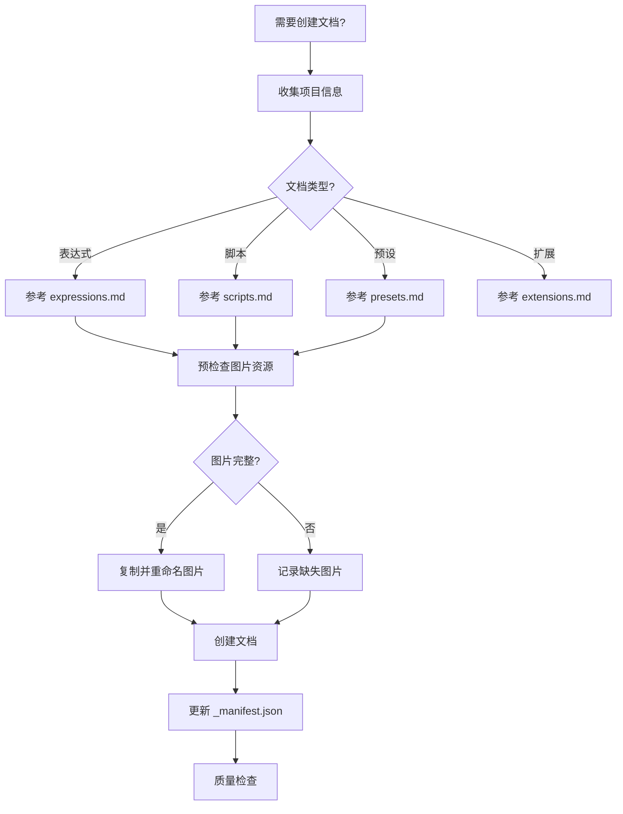

# 文档编写技能

## 概述

为 AE 脚本市场内容系统创建文档。

**核心规则：**
- 统一的元数据格式
- 正确的目录和图片路径
- 网络地址作为下载链接
- 更新对应的 _manifest.json

**必需前置技能：** 使用 `superpowers:test-driven-development` 确保文档质量

## 工作流程



## 标准元数据（必须）

所有文档必须包含以下 YAML 前置元数据：

```yaml
---
title: 文档标题
iconEmoji: 🔧
author: 烟囱鸭
tags: [标签1, 标签2, 标签3]
category: 类别
description: 简短副标题
updatedAt: YYYY-MM-DD
---
```

## 目录结构

```
public/content/
├── expressions/
│   ├── _manifest.json
│   ├── *.md
│   └── assets/          # 图片资源
├── scripts/
│   ├── _manifest.json
│   ├── *.md
│   └── assets/
├── presets/
│   ├── _manifest.json
│   ├── *.md
│   └── assets/
└── extensions/
    ├── _manifest.json
    ├── *.md
    └── assets/
```

## 子文档

- **expressions.md** - 表达式文档要点
- **scripts.md** - 脚本文档要点
- **presets.md** - 预设文档要点
- **extensions.md** - 扩展文档要点
- **shared/image-resources.md** - 图片资源管理
- **shared/download-links.md** - 下载链接规范
- **examples/** - 文档示例（参考）

## 重要注意事项

### 1. 图片引用

**只引用实际存在的图片：**
- 不要添加不存在的图片链接
- 如果没有实际图片，使用文字描述代替
- 图片路径格式：`./assets/filename.png`

### 2. 相关文档链接

**链接格式（前端路由）：**
```markdown
✅ [文档名称](./document-name)   # 不包含 .md
❌ [文档名称](./document-name.md) # 包含 .md 会导致无法打开
```

**只引用实际存在的文档：**
- 表达式：检查 `public/content/expressions/_manifest.json`
- 脚本：检查 `public/content/scripts/_manifest.json`
- 预设：检查 `public/content/presets/_manifest.json`
- 扩展：检查 `public/content/extensions/_manifest.json`

## 核心规则（必须）

### 1. 图片路径

**规则 A - 文档内图片引用（相对路径）：**
```markdown
✅ 
❌ 
```

**规则 B - 封面图片元数据（绝对路径，以 /content 开头）：**

```yaml
---
title: 文档标题
coverImage: /content/scripts/assets/my-script-cover.png
---
```

**⚠️ 重要：**
- 封面图片路径必须使用 `/content/{类型}/assets/{文件名}` 格式
- 不能使用 `./assets/xxx.png` 或 `assets/xxx.png`，否则图片无法显示
- 前端会将此路径直接作为 img src 使用

### 2. 封面图片命名规范

**规则：** 使用 `{slug}-cover.{ext}` 格式，避免同名冲突

```yaml
# ✅ 正确示例
coverImage: /content/scripts/assets/auto-tinify-cover.png
coverImage: /content/scripts/assets/shape-morpher-cover.png
coverImage: /content/presets/animation-cover.webp

# ❌ 错误示例（容易与其他文档冲突）
coverImage: ./assets/cover.png
coverImage: ./assets/cover.jpg
```

**命名格式：**
- 文档内图片：`{slug}-{用途}.{ext}`（如 `auto-tinify-main.jpg`、`auto-tinify-logpanel.jpg`）
- 封面图片：`{slug}-cover.{ext}`（如 `auto-tinify-cover.png`）

### 3. 图片资源预检查

**创建文档前必须：**

1. **检查项目是否有 assets 目录**
   - 在项目根目录查找 `assets` 文件夹
   - 常见位置：`{项目}/assets`、`{项目}/docs/assets`、`{项目}/source/assets`

2. **列出所有可用图片**
   - 记录所有图片文件名
   - 确认需要的图片都已存在

3. **复制图片到正确位置**
   - 从项目 assets 复制到 `public/content/{类型}/assets/`
   - 重命名时添加 slug 前缀避免冲突

**常见缺失图片导致的问题：**
- 文档中引用了 `logpanel.jpg` 但图片不存在 → 显示为破损图片
- 封面图片路径格式错误 → 显示为缺失

### 2. 下载链接

**规则：** 使用网络地址，不使用本地路径

```markdown
✅ 🔗 [下载](https://github.com/.../file.ext)
❌ 🔗 [下载](/downloads/file.ext)
```

### 3. 清单更新

**规则：** 在对应目录的 `_manifest.json` 数组中添加文件名

```json
["existing-doc.md", "new-doc.md"]
```

## 快速参考

| 文档类型 | 参考文档 | 示例文件 |
|----------|----------|----------|
| 表达式 | expressions.md | examples/expression-example.md |
| 脚本 | scripts.md | examples/script-example.md |
| 预设 | presets.md | examples/preset-example.md |
| 扩展 | extensions.md | examples/extension-example.md |

## 参考资源

- **shared/image-resources.md** - 图片资源管理
- **shared/download-links.md** - 下载链接规范
- **examples/** - 文档示例（参考，非模板）

## 质量检查（必须）

- [ ] 元数据包含所有必需字段（title, author, tags, description, updatedAt）
- [ ] 如有封面图片，`coverImage` 使用 `/content/xxx/assets/xxx` 格式（以 /content 开头）
- [ ] 封面图片命名使用 `{slug}-cover.{ext}` 格式，避免同名冲突
- [ ] 文件保存在正确的 `public/content/{模块类型}/` 目录
- [ ] 下载链接使用网络地址
- [ ] 文档内图片使用相对路径 `./assets/`
- [ ] 文档中引用的所有图片文件都存在于 assets 目录
- [ ] 已更新对应的 `_manifest.json`

## 参考示例

查看现有文档：
- `public/content/expressions/auto-keyframe.md`
- `public/content/scripts/script-complete-guide.md`
- `public/content/presets/animation.md`
- `public/content/extensions/extension-dev-guide.md`