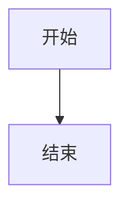
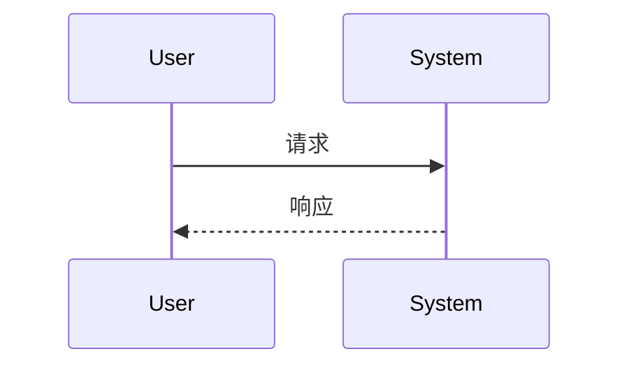
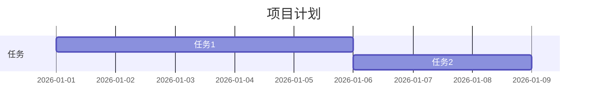
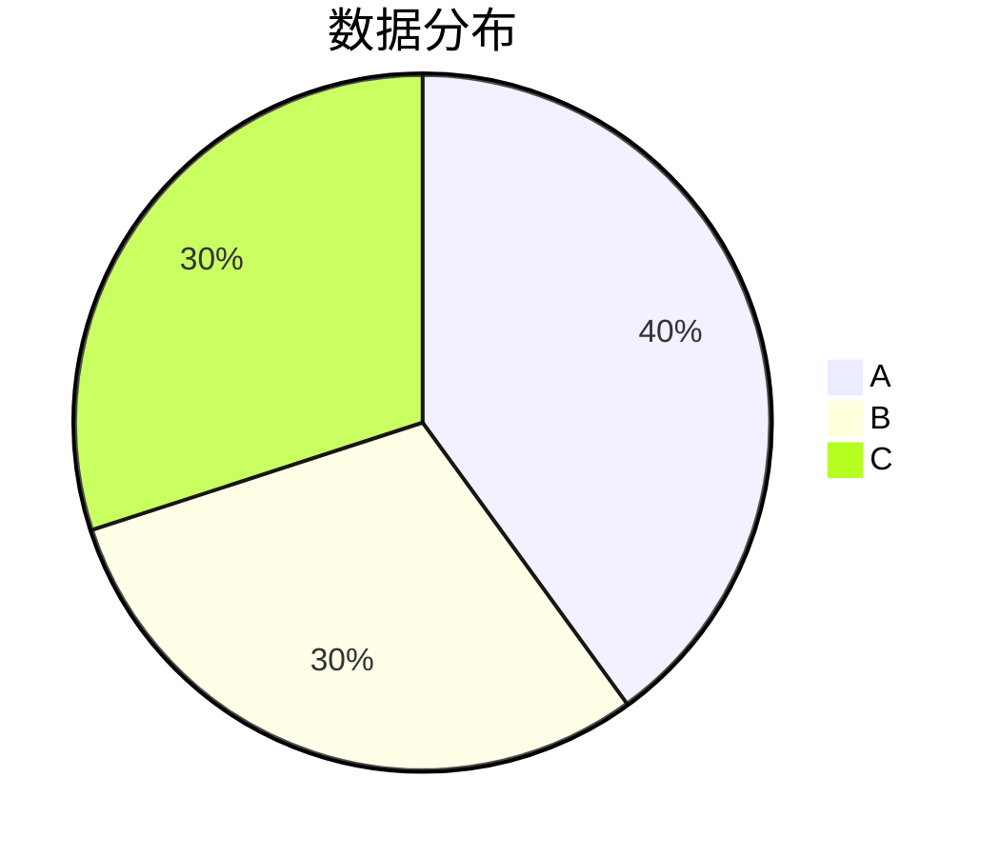

# AE脚本市场

一个现代的 After Effects 脚本市场平台，提供表达式、脚本、预设和扩展的浏览与管理功能。

## 特性

- 📚 **Markdown 文档渲染** - 支持完整的 Markdown 语法
- 🎨 **Mermaid 图表** - 流程图、时序图、甘特图、饼图
- 💻 **代码高亮** - 支持 100+ 种编程语言
- 🌓 **主题切换** - 深色/亮色模式
- 📑 **自动目录** - 自动提取标题并生成目录
- 🔍 **搜索和过滤** - 标签过滤和模糊搜索
- 📋 **一键复制** - 代码块和图表代码复制
- 🔍 **全屏查看** - 图表全屏查看和缩放
- 📱 **响应式设计** - 完美适配桌面和移动端

## 在线预览

访问 [在线演示](https://example.com) 查看实时预览。

## 技术栈

### 核心技术
- **React 18** - 用户界面
- **TypeScript** - 类型安全
- **Vite 5** - 构建工具
- **React Router** - 路由管理

### UI 组件
- **Radix UI** - 无障碍组件库
- **shadcn/ui** - 组件模板
- **Tailwind CSS** - 样式框架
- **Lucide React** - 图标库

### 功能库
- **React Markdown** - Markdown 渲染
- **Mermaid** - 图表渲染
- **React Syntax Highlighter** - 代码高亮
- **Sonner** - Toast 通知
- **Recharts** - 数据可视化

## 快速开始

### 安装依赖

```bash
npm install
```

### 启动开发服务器

```bash
npm run dev
```

访问 http://localhost:5173

### 构建生产版本

```bash
npm run build
```

## 项目结构

```
AE脚本市场/
├── public/                    # 静态资源
│   ├── content/               # Markdown 文档
│   │   ├── expressions/        # 表达式文档
│   │   ├── scripts/            # 脚本文档
│   │   ├── presets/            # 预设文档
│   │   └── extensions/         # 扩展文档
│   └── favicon.ico
├── src/                       # 源代码
│   ├── components/             # React 组件
│   │   ├── ui/                # UI 组件
│   │   ├── Navbar.tsx
│   │   ├── TabContent.tsx      # 文档内容组件
│   │   ├── TabCard.tsx         # 卡片组件
│   │   ├── TabPanel.tsx       # 面板组件
│   │   └── ...
│   ├── contexts/               # React Context
│   │   └── ThemeContext.tsx    # 主题管理
│   ├── lib/                    # 工具函数
│   │   ├── content.ts          # 内容加载
│   │   └── utils.ts
│   ├── App.tsx                 # 根组件
│   ├── main.tsx                # 入口文件
│   └── index.css               # 全局样式
├── docs/                      # 文档
│   ├── INSTALL.md              # 安装指南
│   └── debug/                  # 调试文档
├── package.json               # 项目配置
├── tsconfig.json             # TypeScript 配置
├── vite.config.ts             # Vite 配置
└── tailwind.config.js         # Tailwind 配置
```

## 功能特性

### 1. 文档浏览

- 四个主要分类：表达式、脚本、预设、扩展
- 卡片式布局，支持标签过滤
- 模糊搜索功能
- 响应式网格布局

### 2. 文档阅读

- 完整的 Markdown 渲染
- 自动生成目录
- 点击目录跳转
- 滚动高亮当前标题
- 主题切换支持

### 3. Mermaid 图表

- 流程图 (graph)
- 时序图 (sequence)
- 甘特图 (gantt)
- 饼图 (pie)
- 全屏查看
- 滚轮缩放 (10% - 1000%)
- 主题适配

### 4. 代码块

- 语法高亮 (100+ 种语言)
- 行号显示
- 一键复制
- Toast 提示
- 横向滚动
- 主题适配

### 5. 主题系统

- 深色模式（默认）
- 亮色模式
- 平滑过渡
- 全局主题变量

## 脚本命令

```bash
# 开发
npm run dev

# 构建
npm run build

# 预览
npm run preview

# 检查
npm run lint
```

## 浏览器支持

| 浏览器 | 版本 |
|--------|------|
| Chrome | 最新版 |
| Firefox | 最新版 |
| Safari | 最新版 |
| Edge | 最新版 |

## 开发指南

### 添加新的文档

1. 在 `public/content/` 对应目录创建 `.md` 文件
2. 在对应的 `_manifest.json` 中添加文件名
3. 添加 frontmatter 元数据

**frontmatter 示例**：

```markdown
---
title: 文档标题
iconEmoji: 🎯
author: 作者名
tags: [标签1, 标签2]
category: 分类
command: 命令
description: 简短描述
updatedAt: 2026-02-05
toc:
  - id: 标题id
    text: 标题文本
    level: 2
---

# 文档内容

...

## 子标题

### 三级标题

```javascript
// 代码示例
const example = 'code';
```

## 图表示例

### 流程图



### 时序图



### 甘特图



### 饼图


```

## 开发规范

### TypeScript

- 启用严格模式
- 使用接口定义 Props
- 避免使用 `any`

### 组件开发

- 使用函数组件
- 使用命名导出
- 添加 Props 接口定义
- 遵循命名约定

### 样式开发

- 使用 Tailwind CSS
- 使用 `cn()` 函数合并类名
- 遵循标准类名顺序

## 测试

### 创建测试文档

参考 `docs/TESTING.md` 创建测试文档，包含：

- 所有 Mermaid 图表类型
- 多种语言的代码块
- 完整的目录结构
- 主题切换测试

## 故障排除

### Vite 缓存问题

```bash
rm -rf node_modules/.vite
rm -rf .vite
npm run dev
```

### 依赖问题

```bash
rm -rf node_modules package-lock.json
npm install
```

## 贡献

欢迎贡献！请查看 [贡献指南](CONTRIBUTING.md)

## 许可证

MIT License

## 联系方式

- 作者: 烟囱鸭
- 项目链接: [GitHub](https://github.com/example/ae-scripts-market)
- 问题反馈: [Issues](https://github.com/example/ae-scripts-market/issues)

## 更新日志

### v1.0.0 (2026-02-05)

#### 新增
- 🎉 初始版本发布
- ✨ 支持 Markdown 文档渲染
- ✨ 支持 Mermaid 图表
- ✨ 支持代码高亮和复制
- ✨ 支持主题切换
- ✨ 支持目录和滚动高亮
- ✨ 支持标签过滤和搜索

#### 优化
- ⚡ 卡片描述省略显示（悬浮查看完整）
- ⚡ 终端组件优化
- ⚡ 图表全屏和缩放功能
- ⚡ 代码块行号显示
- ⚡ Toast 提示功能
- ⚡ 甘特图和饼图样式优化

#### 修复
- 🐛 修复 frontmatter 解析问题
- 🐛 修复 Mermaid 图表渲染问题
- 🐛 修复主题切换后目录高亮失效
- 🐛 修复代码块多行显示问题
- 🐛 修复 WebSocket 连接问题

---

**Made with ❤️ by 烟囱鸭**
