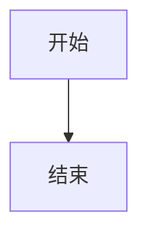
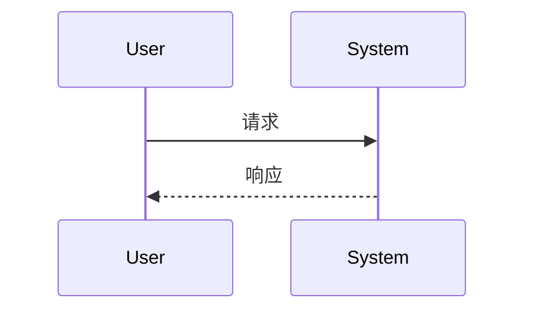
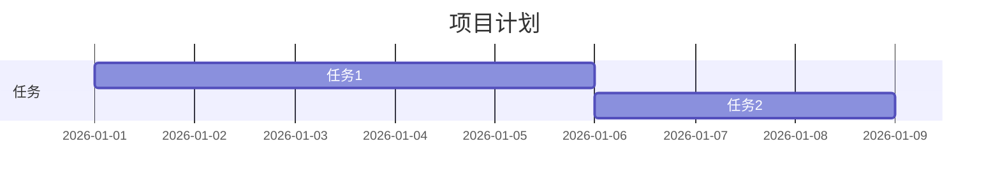
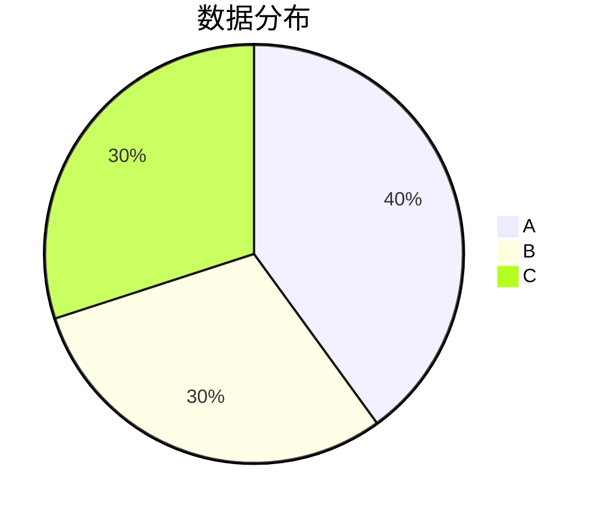

# AE Scripts Marketplace

<div align="center">

[English](#english) | [中文](#中文)

**A modern After Effects script marketplace platform**

提供表达式、脚本、预设和扩展的浏览与管理功能

[Live Demo](https://aemarketplace.vercel.app/) · [Report Bug](https://github.com/yancongya/AE-Marketplace/issues) · [Request Feature](https://github.com/yancongya/AE-Marketplace/issues)

</div>

---

## 中文

一个现代化的 After Effects 脚本市场平台，提供表达式、脚本、预设和扩展的浏览与管理功能。基于 React + TypeScript + Vite 构建，采用 Tailwind CSS 设计，提供流畅的用户体验和专业的文档展示。

### 核心特性

#### 📚 文档管理
- **Markdown 渲染** - 完整支持 CommonMark 和 GFM 语法
- **Mermaid 图表** - 流程图、时序图、甘特图、饼图、思维导图等
- **代码高亮** - 支持 100+ 种编程语言的语法高亮
- **自动目录** - 智能提取标题并生成可交互目录
- **滚动高亮** - 实时追踪阅读位置并高亮对应目录项

#### 🎨 用户界面
- **主题切换** - 深色/亮色模式，平滑过渡动画
- **响应式设计** - 完美适配桌面、平板和移动设备
- **终端风格** - 独特的终端风格 UI 设计
- **无障碍访问** - 基于 Radix UI 的可访问性组件

#### 🔧 功能特性
- **搜索过滤** - 标签过滤和模糊搜索
- **一键复制** - 代码块和图表代码快速复制
- **全屏查看** - 图表全屏查看和滚轮缩放（10% - 1000%）
- **国际化支持** - 中英文双语切换
- **管理员模式** - 开发环境下的内容管理功能

#### ⚡ 性能优化
- **Vite 构建** - 极速的开发服务器和生产构建
- **代码分割** - 按需加载，优化首屏渲染
- **懒加载** - 图表和组件按需加载
- **TypeScript** - 完整的类型安全保障

### 技术栈

#### 核心框架
```
React 18.3.x          - UI 库
TypeScript 5.x        - 类型系统
Vite 5.x              - 构建工具
React Router 6.x      - 路由管理
```

#### UI 框架
```
Tailwind CSS 3.x      - 原子化 CSS
Radix UI              - 无障碍组件库
shadcn/ui             - 组件模板
Lucide React          - 图标库
Framer Motion         - 动画库
```

#### 功能库
```
React Markdown        - Markdown 渲染
Mermaid 11.x          - 图表渲染
React Syntax Highlighter - 代码高亮
Sonner                - Toast 通知
Recharts              - 数据可视化
Zod                   - 数据验证
React Hook Form       - 表单管理
```

### 快速开始

#### 环境要求
- Node.js >= 18.x
- npm >= 9.x

#### 安装依赖
```bash
npm install
```

#### 启动开发服务器
```bash
npm run dev
```
访问 http://localhost:5173

#### 构建生产版本
```bash
npm run build
```

#### 预览生产构建
```bash
npm run preview
```

#### 运行代码检查
```bash
npm run lint
```

### 项目结构

```
AE脚本市场/
├── public/                      # 静态资源
│   ├── content/                 # Markdown 文档
│   │   ├── expressions/         # 表达式文档
│   │   ├── scripts/             # 脚本文档
│   │   ├── presets/             # 预设文档
│   │   └── extensions/          # 扩展文档
│   ├── locales/                 # 国际化配置
│   │   ├── zh.json             # 中文
│   │   └── en.json             # 英文
│   └── favicon.svg
│
├── src/                         # 源代码
│   ├── components/              # React 组件
│   │   ├── ui/                 # UI 组件
│   │   │   ├── button.tsx
│   │   │   ├── dialog.tsx
│   │   │   ├── input.tsx
│   │   │   └── ...
│   │   ├── Navbar.tsx          # 导航栏
│   │   ├── TabContent.tsx      # 文档内容
│   │   ├── TabCard.tsx         # 卡片组件
│   │   ├── TabPanel.tsx        # 标签面板
│   │   ├── ExpressionsTab.tsx  # 表达式标签
│   │   ├── ScriptsTab.tsx      # 脚本标签
│   │   ├── PresetsTab.tsx      # 预设标签
│   │   ├── ExtensionsTab.tsx   # 扩展标签
│   │   └── ...
│   │
│   ├── contexts/                # React Context
│   │   ├── ThemeContext.tsx    # 主题管理
│   │   ├── I18nContext.tsx     # 国际化
│   │   └── AdminContext.tsx    # 管理员
│   │
│   ├── hooks/                   # 自定义 Hooks
│   │   └── use-mobile.ts       # 移动端检测
│   │
│   ├── lib/                     # 工具函数
│   │   ├── content.ts          # 内容加载
│   │   └── utils.ts            # 通用工具
│   │
│   ├── types/                   # TypeScript 类型
│   │   └── index.ts
│   │
│   ├── App.tsx                  # 根组件
│   ├── main.tsx                 # 入口文件
│   └── index.css                # 全局样式
│
├── content/                     # 开发环境内容
│   ├── expressions/
│   ├── scripts/
│   ├── presets/
│   └── extensions/
│
├── docs/                        # 文档
│   ├── TESTING.md              # 测试指南
│   └── debug/                  # 调试文档
│
├── .agents/                     # AI Agent 技能
├── scripts/                     # 脚本工具
│
├── package.json                 # 项目配置
├── tsconfig.json               # TypeScript 配置
├── vite.config.ts              # Vite 配置
├── tailwind.config.js          # Tailwind 配置
├── vercel.json                 # Vercel 配置
└── vite-plugin-admin-api.ts    # 开发环境 API
```

### 功能详解

#### 1. 文档浏览系统

**分类管理**
- 四大分类：表达式、脚本、预设、扩展
- 卡片式布局，支持标签过滤
- 模糊搜索功能，实时响应
- 响应式网格布局（移动端自适应）

**卡片展示**
- 终端风格窗口设计
- 标题、图标、描述、标签
- 悬浮查看完整描述
- 右键删除功能（开发环境）

#### 2. 文档阅读体验

**Markdown 渲染**
- 完整的 CommonMark 和 GFM 支持
- 任务列表、表格、删除线等扩展语法
- HTML 标签支持（通过 rehype-raw）
- 自定义组件渲染

**目录导航**
- 自动提取所有标题（H2-H4）
- 点击目录平滑滚动到对应位置
- 滚动时自动高亮当前章节
- 固定侧边栏，方便导航

**交互功能**
- 一键复制代码块
- 图表全屏查看
- 滚轮缩放图表
- Toast 消息提示

#### 3. Mermaid 图表支持

**支持的图表类型**
- 流程图
- 时序图
- 甘特图
- 饼图
- 思维导图
- 状态图
- 类图
- 实体关系图
- 用户旅程图
- 矩阵图
- Git 图
- C4 架构图
- 等等...

**交互功能**
- 全屏查看
- 滚轮缩放（10% - 1000%）
- 主题自动适配（深色/亮色）
- SVG 导出（复制）

#### 4. 代码高亮系统

**语言支持**
- 100+ 种编程语言
- JavaScript, TypeScript, Python, Java, C++, Go, Rust, etc.
- 自动语言检测
- 自定义主题

**功能特性**
- 语法高亮
- 行号显示
- 一键复制
- 横向滚动
- 主题适配

#### 5. 主题系统

**主题模式**
- 深色模式（默认）
- 亮色模式
- 系统主题（跟随系统）
- 平滑过渡动画

**主题配置**
- 全局 CSS 变量
- Tailwind CSS 主题配置
- 组件级别主题支持

#### 6. 国际化 (i18n)

**支持语言**
- 简体中文
- English

**功能特性**
- 语言切换无需刷新
- 所有文本可翻译
- 日期本地化
- RTL 支持（未来）

#### 7. 管理员模式

**功能**
- 开发环境专用
- 密码保护登录
- 创建新文档
- 编辑现有文档
- 删除文档
- 自动更新配置文件

**安全特性**
- 仅限开发环境
- 生产环境完全禁用
- 本地文件操作
- 自动备份

### 开发指南

#### 添加新文档

1. **创建 Markdown 文件**
   ```
   public/content/{category}/{filename}.md
   ```

2. **添加 Frontmatter**
   ```markdown
   ---
   title: 文档标题
   iconEmoji: 🎯
   author: 作者名
   tags: [标签1, 标签2]
   command: 命令（可选）
   description: 简短描述
   updatedAt: 2026-03-10
   toc:
     - id: 标题id
       text: 标题文本
       level: 2
   ---

   # 文档内容
   ```

3. **更新配置文件**
   - 开发环境：自动更新
   - 生产环境：手动更新 `public/content/{category}/_manifest.json`

#### 添加翻译

编辑 `public/locales/{lang}.json`：

```json
{
  "nav": {
    "expressions": "表达式",
    "scripts": "脚本",
    "presets": "预设",
    "extensions": "扩展"
  },
  "common": {
    "themeToggle": {
      "dark": "切换到深色模式",
      "light": "切换到亮色模式"
    }
  }
}
```

#### 开发规范

**TypeScript**
- 启用严格模式
- 使用接口定义 Props
- 避免使用 `any`
- 提供类型注释

**React 组件**
- 使用函数组件
- 使用命名导出
- 添加 Props 接口
- 遵循命名约定

**样式开发**
- 使用 Tailwind CSS
- 使用 `cn()` 合并类名
- 遵循类名顺序规范
- 响应式优先

### 部署

#### Vercel 部署

项目已配置 Vercel，支持自动部署：

1. 连接 GitHub 仓库
2. 自动检测配置
3. 每次推送自动部署
4. 预览环境自动生成

**环境变量**
- 无需配置（纯静态站点）

#### 手动部署

```bash
# 构建
npm run build

# 部署 dist/ 目录到任意静态托管服务
# 如：Netlify, GitHub Pages, Cloudflare Pages, etc.
```

### 浏览器支持

| 浏览器 | 最低版本 | 推荐版本 |
|--------|---------|---------|
| Chrome | 90+ | 最新版 |
| Firefox | 88+ | 最新版 |
| Safari | 14+ | 最新版 |
| Edge | 90+ | 最新版 |

### 故障排除

#### Vite 缓存问题
```bash
# 清除缓存
rm -rf node_modules/.vite
rm -rf .vite
npm run dev
```

#### 依赖问题
```bash
# 重新安装依赖
rm -rf node_modules package-lock.json
npm install
```

#### TypeScript 错误
```bash
# 重新生成类型
npm run build
```

### 贡献指南

欢迎贡献！请遵循以下步骤：

1. Fork 本仓库
2. 创建特性分支 (`git checkout -b feature/AmazingFeature`)
3. 提交更改 (`git commit -m 'Add some AmazingFeature'`)
4. 推送到分支 (`git push origin feature/AmazingFeature`)
5. 开启 Pull Request

详细指南请查看 [CONTRIBUTING.md](CONTRIBUTING.md)

### 许可证

本项目采用 MIT 许可证 - 查看 [LICENSE](LICENSE) 文件了解详情

### 联系方式

**作者** - 烟囱鸭

**项目链接** - [https://github.com/yancongya/AE-Marketplace](https://github.com/yancongya/AE-Marketplace)

**在线演示** - [https://aemarketplace.vercel.app/](https://aemarketplace.vercel.app/)

**问题反馈** - [GitHub Issues](https://github.com/yancongya/AE-Marketplace/issues)

### 致谢

- [React](https://reactjs.org/)
- [Vite](https://vitejs.dev/)
- [Tailwind CSS](https://tailwindcss.com/)
- [Radix UI](https://www.radix-ui.com/)
- [Mermaid](https://mermaid-js.github.io/)
- 所有贡献者

---

<div align="center">
  <sub>Built with ❤️ by 烟囱鸭</sub>
</div>

---

## English

A modern After Effects script marketplace platform built with React + TypeScript + Vite, featuring Tailwind CSS styling and providing a smooth user experience with professional document presentation.

### Core Features

#### 📚 Document Management
- **Markdown Rendering** - Full support for CommonMark and GFM syntax
- **Mermaid Diagrams** - Flowcharts, sequence diagrams, Gantt charts, pie charts, mind maps, and more
- **Code Highlighting** - Syntax highlighting for 100+ programming languages
- **Auto TOC** - Intelligently extract headings and generate interactive table of contents
- **Scroll Highlighting** - Real-time reading position tracking with active section highlighting

#### 🎨 User Interface
- **Theme Switching** - Dark/Light mode with smooth transition animations
- **Responsive Design** - Perfect adaptation for desktop, tablet, and mobile devices
- **Terminal Style** - Unique terminal-style UI design
- **Accessibility** - Accessible components based on Radix UI

#### 🔧 Functionality
- **Search & Filter** - Tag filtering and fuzzy search
- **One-Click Copy** - Quick copy for code blocks and diagram code
- **Full Screen View** - Diagram fullscreen viewing and scroll zoom (10% - 1000%)
- **i18n Support** - Chinese/English bilingual switching
- **Admin Mode** - Content management in development environment

#### ⚡ Performance
- **Vite Build** - Lightning-fast dev server and production build
- **Code Splitting** - On-demand loading for optimal first render
- **Lazy Loading** - Diagrams and components load on demand
- **TypeScript** - Complete type safety

### Tech Stack

#### Core Framework
```
React 18.3.x          - UI Library
TypeScript 5.x        - Type System
Vite 5.x              - Build Tool
React Router 6.x      - Routing
```

#### UI Framework
```
Tailwind CSS 3.x      - Utility CSS
Radix UI              - Accessible Components
shadcn/ui             - Component Templates
Lucide React          - Icon Library
Framer Motion         - Animation Library
```

#### Functionality Libraries
```
React Markdown        - Markdown Rendering
Mermaid 11.x          - Diagram Rendering
React Syntax Highlighter - Code Highlighting
Sonner                - Toast Notifications
Recharts              - Data Visualization
Zod                   - Data Validation
React Hook Form       - Form Management
```

### Quick Start

#### Prerequisites
- Node.js >= 18.x
- npm >= 9.x

#### Install Dependencies
```bash
npm install
```

#### Start Development Server
```bash
npm run dev
```
Visit http://localhost:5173

#### Build for Production
```bash
npm run build
```

#### Preview Production Build
```bash
npm run preview
```

#### Run Linting
```bash
npm run lint
```

### Project Structure

```
AE-Marketplace/
├── public/                      # Static Assets
│   ├── content/                 # Markdown Documents
│   │   ├── expressions/         # Expressions
│   │   ├── scripts/             # Scripts
│   │   ├── presets/             # Presets
│   │   └── extensions/          # Extensions
│   ├── locales/                 # i18n Config
│   │   ├── zh.json             # Chinese
│   │   └── en.json             # English
│   └── favicon.svg
│
├── src/                         # Source Code
│   ├── components/              # React Components
│   │   ├── ui/                 # UI Components
│   │   ├── Navbar.tsx          # Navigation Bar
│   │   ├── TabContent.tsx      # Document Content
│   │   ├── TabCard.tsx         # Card Component
│   │   ├── TabPanel.tsx        # Tab Panel
│   │   ├── ExpressionsTab.tsx  # Expressions Tab
│   │   ├── ScriptsTab.tsx      # Scripts Tab
│   │   ├── PresetsTab.tsx      # Presets Tab
│   │   ├── ExtensionsTab.tsx   # Extensions Tab
│   │   └── ...
│   │
│   ├── contexts/                # React Contexts
│   │   ├── ThemeContext.tsx    # Theme Management
│   │   ├── I18nContext.tsx     # Internationalization
│   │   └── AdminContext.tsx    # Admin Mode
│   │
│   ├── hooks/                   # Custom Hooks
│   │   └── use-mobile.ts       # Mobile Detection
│   │
│   ├── lib/                     # Utilities
│   │   ├── content.ts          # Content Loading
│   │   └── utils.ts            # General Utilities
│   │
│   ├── types/                   # TypeScript Types
│   │   └── index.ts
│   │
│   ├── App.tsx                  # Root Component
│   ├── main.tsx                 # Entry Point
│   └── index.css                # Global Styles
│
├── content/                     # Dev Environment Content
├── docs/                        # Documentation
│   ├── TESTING.md              # Testing Guide
│   └── debug/                  # Debug Docs
│
├── .agents/                     # AI Agent Skills
├── scripts/                     # Utility Scripts
│
├── package.json                 # Project Config
├── tsconfig.json               # TypeScript Config
├── vite.config.ts              # Vite Config
├── tailwind.config.js          # Tailwind Config
├── vercel.json                 # Vercel Config
└── vite-plugin-admin-api.ts    # Dev Environment API
```

### Feature Details

#### 1. Document Browsing System

**Category Management**
- Four main categories: Expressions, Scripts, Presets, Extensions
- Card layout with tag filtering
- Fuzzy search with real-time response
- Responsive grid layout (mobile adaptive)

**Card Display**
- Terminal-style window design
- Title, icon, description, tags
- Hover to view full description
- Right-click delete (dev environment)

#### 2. Document Reading Experience

**Markdown Rendering**
- Full CommonMark and GFM support
- Task lists, tables, strikethrough, etc.
- HTML tag support (via rehype-raw)
- Custom component rendering

**TOC Navigation**
- Auto-extract all headings (H2-H4)
- Click to smooth scroll to section
- Scroll to auto-highlight current section
- Fixed sidebar for easy navigation

**Interactive Features**
- One-click copy code blocks
- Diagram fullscreen view
- Scroll zoom diagrams
- Toast notifications

#### 3. Mermaid Diagram Support

**Supported Diagram Types**
- Flowcharts
- Sequence Diagrams
- Gantt Charts
- Pie Charts
- Mind Maps
- State Diagrams
- Class Diagrams
- Entity Relationship Diagrams
- User Journey Diagrams
- Matrix Diagrams
- Git Graphs
- C4 Architecture Diagrams
- And more...

**Interactive Features**
- Fullscreen viewing
- Scroll zoom (10% - 1000%)
- Auto theme adaptation (dark/light)
- SVG export (copy)

#### 4. Code Highlighting System

**Language Support**
- 100+ programming languages
- JavaScript, TypeScript, Python, Java, C++, Go, Rust, etc.
- Auto language detection
- Custom themes

**Features**
- Syntax highlighting
- Line numbers
- One-click copy
- Horizontal scroll
- Theme adaptation

#### 5. Theme System

**Theme Modes**
- Dark mode (default)
- Light mode
- System theme (follow system)
- Smooth transition animation

**Theme Configuration**
- Global CSS variables
- Tailwind CSS theme config
- Component-level theme support

#### 6. Internationalization (i18n)

**Supported Languages**
- Simplified Chinese
- English

**Features**
- Language switch without refresh
- All text translatable
- Date localization
- RTL support (future)

#### 7. Admin Mode

**Features**
- Development environment only
- Password-protected login
- Create new documents
- Edit existing documents
- Delete documents
- Auto-update config files

**Security**
- Development environment only
- Completely disabled in production
- Local file operations
- Auto backup

### Development Guide

#### Adding New Documents

1. **Create Markdown File**
   ```
   public/content/{category}/{filename}.md
   ```

2. **Add Frontmatter**
   ```markdown
   ---
   title: Document Title
   iconEmoji: 🎯
   author: Author Name
   tags: [tag1, tag2]
   command: Command (optional)
   description: Short description
   updatedAt: 2026-03-10
   toc:
     - id: heading-id
       text: Heading Text
       level: 2
   ---

   # Document Content
   ```

3. **Update Config File**
   - Dev environment: Auto-updated
   - Production: Manually update `public/content/{category}/_manifest.json`

#### Adding Translations

Edit `public/locales/{lang}.json`:

```json
{
  "nav": {
    "expressions": "Expressions",
    "scripts": "Scripts",
    "presets": "Presets",
    "extensions": "Extensions"
  },
  "common": {
    "themeToggle": {
      "dark": "Switch to Dark Mode",
      "light": "Switch to Light Mode"
    }
  }
}
```

#### Development Standards

**TypeScript**
- Strict mode enabled
- Use interfaces for Props
- Avoid using `any`
- Provide type annotations

**React Components**
- Use function components
- Use named exports
- Add Props interfaces
- Follow naming conventions

**Styling**
- Use Tailwind CSS
- Use `cn()` to merge classes
- Follow class name order
- Mobile-first responsive

### Deployment

#### Vercel Deployment

Project is configured for Vercel with auto-deployment:

1. Connect GitHub repository
2. Auto-detect configuration
3. Auto-deploy on every push
4. Preview environments auto-generated

**Environment Variables**
- None required (static site)

#### Manual Deployment

```bash
# Build
npm run build

# Deploy dist/ directory to any static hosting service
# Like: Netlify, GitHub Pages, Cloudflare Pages, etc.
```

### Browser Support

| Browser | Minimum | Recommended |
|---------|---------|-------------|
| Chrome | 90+ | Latest |
| Firefox | 88+ | Latest |
| Safari | 14+ | Latest |
| Edge | 90+ | Latest |

### Troubleshooting

#### Vite Cache Issues
```bash
# Clear cache
rm -rf node_modules/.vite
rm -rf .vite
npm run dev
```

#### Dependency Issues
```bash
# Reinstall dependencies
rm -rf node_modules package-lock.json
npm install
```

#### TypeScript Errors
```bash
# Regenerate types
npm run build
```

### Contributing

Contributions are welcome! Please follow these steps:

1. Fork the repository
2. Create a feature branch (`git checkout -b feature/AmazingFeature`)
3. Commit your changes (`git commit -m 'Add some AmazingFeature'`)
4. Push to the branch (`git push origin feature/AmazingFeature`)
5. Open a Pull Request

For detailed guidelines, see [CONTRIBUTING.md](CONTRIBUTING.md)

### License

This project is licensed under the MIT License - see the [LICENSE](LICENSE) file for details

### Contact

**Author** - 烟囱鸭

**Project Link** - [https://github.com/yancongya/AE-Marketplace](https://github.com/yancongya/AE-Marketplace)

**Live Demo** - [https://aemarketplace.vercel.app/](https://aemarketplace.vercel.app/)

**Bug Reports** - [GitHub Issues](https://github.com/yancongya/AE-Marketplace/issues)

### Acknowledgments

- [React](https://reactjs.org/)
- [Vite](https://vitejs.dev/)
- [Tailwind CSS](https://tailwindcss.com/)
- [Radix UI](https://www.radix-ui.com/)
- [Mermaid](https://mermaid-js.github.io/)
- All contributors

---

<div align="center">
  <sub>Built with ❤️ by 烟囱鸭</sub>
</div>

## 技术栈

### 核心技术
- **React 18** - 用户界面
- **TypeScript** - 类型安全
- **Vite 5** - 构建工具
- **React Router** - 路由管理

### UI 组件
- **Radix UI** - 无障碍组件库
- **shadcn/ui** - 组件模板
- **Tailwind CSS** - 样式框架
- **Lucide React** - 图标库

### 功能库
- **React Markdown** - Markdown 渲染
- **Mermaid** - 图表渲染
- **React Syntax Highlighter** - 代码高亮
- **Sonner** - Toast 通知
- **Recharts** - 数据可视化

## 快速开始

### 安装依赖

```bash
npm install
```

### 启动开发服务器

```bash
npm run dev
```

访问 http://localhost:5173

### 构建生产版本

```bash
npm run build
```

## 项目结构

```
AE脚本市场/
├── public/                    # 静态资源
│   ├── content/               # Markdown 文档
│   │   ├── expressions/        # 表达式文档
│   │   ├── scripts/            # 脚本文档
│   │   ├── presets/            # 预设文档
│   │   └── extensions/         # 扩展文档
│   └── favicon.ico
├── src/                       # 源代码
│   ├── components/             # React 组件
│   │   ├── ui/                # UI 组件
│   │   ├── Navbar.tsx
│   │   ├── TabContent.tsx      # 文档内容组件
│   │   ├── TabCard.tsx         # 卡片组件
│   │   ├── TabPanel.tsx       # 面板组件
│   │   └── ...
│   ├── contexts/               # React Context
│   │   └── ThemeContext.tsx    # 主题管理
│   ├── lib/                    # 工具函数
│   │   ├── content.ts          # 内容加载
│   │   └── utils.ts
│   ├── App.tsx                 # 根组件
│   ├── main.tsx                # 入口文件
│   └── index.css               # 全局样式
├── docs/                      # 文档
│   ├── INSTALL.md              # 安装指南
│   └── debug/                  # 调试文档
├── package.json               # 项目配置
├── tsconfig.json             # TypeScript 配置
├── vite.config.ts             # Vite 配置
└── tailwind.config.js         # Tailwind 配置
```

## 功能特性

### 1. 文档浏览

- 四个主要分类：表达式、脚本、预设、扩展
- 卡片式布局，支持标签过滤
- 模糊搜索功能
- 响应式网格布局

### 2. 文档阅读

- 完整的 Markdown 渲染
- 自动生成目录
- 点击目录跳转
- 滚动高亮当前标题
- 主题切换支持

### 3. Mermaid 图表

- 流程图 (graph)
- 时序图 (sequence)
- 甘特图 (gantt)
- 饼图 (pie)
- 全屏查看
- 滚轮缩放 (10% - 1000%)
- 主题适配

### 4. 代码块

- 语法高亮 (100+ 种语言)
- 行号显示
- 一键复制
- Toast 提示
- 横向滚动
- 主题适配

### 5. 主题系统

- 深色模式（默认）
- 亮色模式
- 平滑过渡
- 全局主题变量

## 脚本命令

```bash
# 开发
npm run dev

# 构建
npm run build

# 预览
npm run preview

# 检查
npm run lint
```

## 浏览器支持

| 浏览器 | 版本 |
|--------|------|
| Chrome | 最新版 |
| Firefox | 最新版 |
| Safari | 最新版 |
| Edge | 最新版 |

## 开发指南

### 添加新的文档

1. 在 `public/content/` 对应目录创建 `.md` 文件
2. 在对应的 `_manifest.json` 中添加文件名
3. 添加 frontmatter 元数据

**frontmatter 示例**：

```markdown
---
title: 文档标题
iconEmoji: 🎯
author: 作者名
tags: [标签1, 标签2]
category: 分类
command: 命令
description: 简短描述
updatedAt: 2026-02-05
toc:
  - id: 标题id
    text: 标题文本
    level: 2
---

# 文档内容

...

## 子标题

### 三级标题

```javascript
// 代码示例
const example = 'code';
```

## 图表示例

### 流程图



### 时序图



### 甘特图



### 饼图


```

## 开发规范

### TypeScript

- 启用严格模式
- 使用接口定义 Props
- 避免使用 `any`

### 组件开发

- 使用函数组件
- 使用命名导出
- 添加 Props 接口定义
- 遵循命名约定

### 样式开发

- 使用 Tailwind CSS
- 使用 `cn()` 函数合并类名
- 遵循标准类名顺序

## 测试

### 创建测试文档

参考 `docs/TESTING.md` 创建测试文档，包含：

- 所有 Mermaid 图表类型
- 多种语言的代码块
- 完整的目录结构
- 主题切换测试

## 故障排除

### Vite 缓存问题

```bash
rm -rf node_modules/.vite
rm -rf .vite
npm run dev
```

### 依赖问题

```bash
rm -rf node_modules package-lock.json
npm install
```

## 贡献

欢迎贡献！请查看 [贡献指南](CONTRIBUTING.md)

## 许可证

MIT License

## 联系方式

- 作者: 烟囱鸭
- 项目链接: [GitHub](https://github.com/example/ae-scripts-market)
- 问题反馈: [Issues](https://github.com/example/ae-scripts-market/issues)

## 更新日志

### v1.0.0 (2026-02-05)

#### 新增
- 🎉 初始版本发布
- ✨ 支持 Markdown 文档渲染
- ✨ 支持 Mermaid 图表
- ✨ 支持代码高亮和复制
- ✨ 支持主题切换
- ✨ 支持目录和滚动高亮
- ✨ 支持标签过滤和搜索

#### 优化
- ⚡ 卡片描述省略显示（悬浮查看完整）
- ⚡ 终端组件优化
- ⚡ 图表全屏和缩放功能
- ⚡ 代码块行号显示
- ⚡ Toast 提示功能
- ⚡ 甘特图和饼图样式优化

#### 修复
- 🐛 修复 frontmatter 解析问题
- 🐛 修复 Mermaid 图表渲染问题
- 🐛 修复主题切换后目录高亮失效
- 🐛 修复代码块多行显示问题
- 🐛 修复 WebSocket 连接问题

---

**Made with ❤️ by 烟囱鸭**
