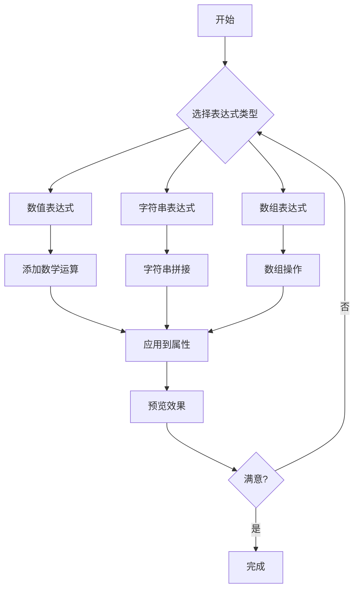
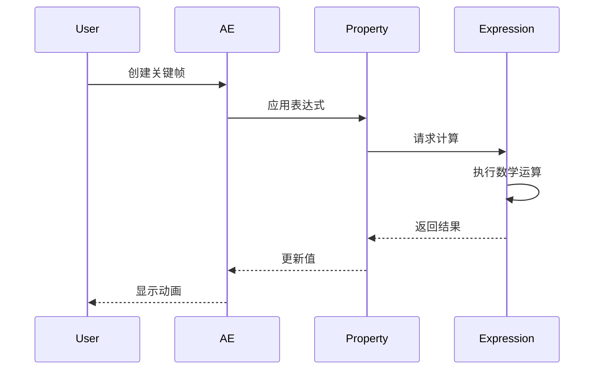
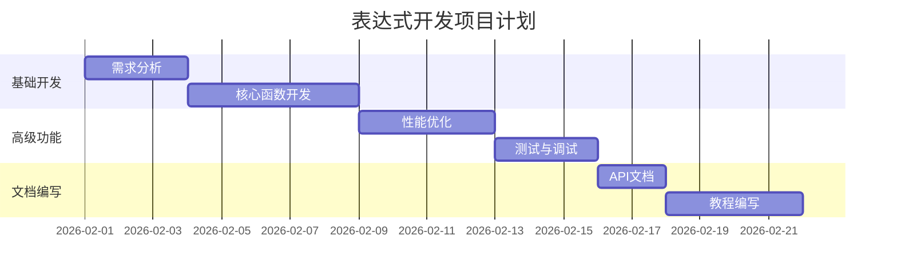
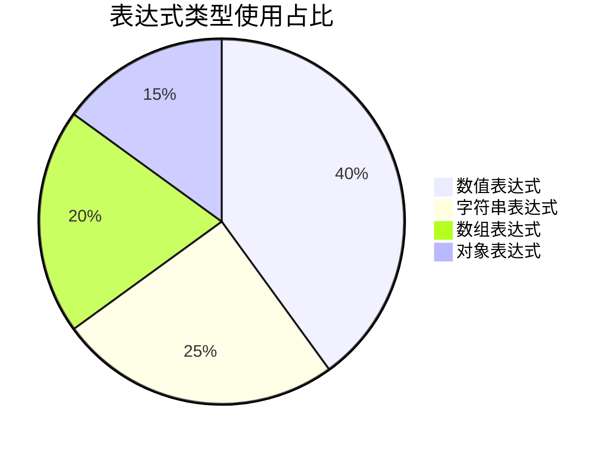

# 表达式高级应用指南

## 基础概念

表达式是After Effects中强大的工具，可以通过数学公式和函数来创建复杂的动画效果。

### 表达式分类

| 类型 | 描述 | 示例 |
|------|------|------|
| 数值表达式 | 返回数字值 | `time * 10` |
| 字符串表达式 | 返回文本 | `"Frame: " + timeToFrames(time)` |
| 数组表达式 | 返回多个值 | `[10, 20, 30]` |

### 常用函数

- **线性插值**: `linear(t, tMin, tMax, value1, value2)`
- **随机**: `random(min, max)`
- **正弦波**: `Math.sin(time * 2 * Math.PI * frequency)`

## 流程图示例

下面是一个表达式应用流程图：



## 时序图示例

表达式执行的时间序列：



## 甘特图示例

表达式开发项目计划：



## 饼图示例

表达式类型分布：



## 代码示例

### 基础表达式

```javascript
// 线性动画
linear(time, inPoint, outPoint, 0, 100)

// 往复运动
Math.sin(time * 2 * Math.PI) * 50

// 随机位置
[random(0, thisComp.width), random(0, thisComp.height)]
```

### 高级表达式

```javascript
// 缓动函数
function ease(t) {
    return t < .5 ? 2 * t * t : -1 + (4 - 2 * t) * t;
}

// 循环动画
function loop(duration = 3) {
    var t = time % duration;
    var progress = t / duration;
    return ease(progress);
}

// 应用到位置
[loop() * thisComp.width, loop() * thisComp.height]
```

### 数学运算

```typescript
// 三角函数
const angle = time * 2 * Math.PI;
const x = Math.cos(angle) * 100;
const y = Math.sin(angle) * 100;
[x, y]

// 向量计算
const start = [0, 0];
const end = [100, 100];
const progress = Math.min(1, time / 2);
lerp(start, end, progress)

// 条件判断
time > 5 ? [200, 200] : [100, 100]
```

### 数组操作

```python
# 数组遍历
const items = [10, 20, 30, 40, 50];
const sum = items.reduce((a, b) => a + b, 0);
const average = sum / items.length;
average

# 数组映射
const positions = [0, 100, 200, 300];
const animated = positions.map(p => p + Math.sin(time) * 10);
animated
```

## 性能优化

### 缓存计算结果

```javascript
// 不好的做法：每次都重新计算
Math.sin(time) * 100

// 好的做法：使用变量缓存
const t = time;
const result = Math.sin(t) * 100;
```

### 避免重复计算

```javascript
// 重复计算
value1 = Math.sin(time) * 50;
value2 = Math.cos(time) * 50;

// 优化后
const t = time;
value1 = Math.sin(t) * 50;
value2 = Math.cos(t) * 50;
```

## 常见问题

### 1. 表达式不生效

**原因**：可能表达式语法错误或属性不支持表达式。

**解决**：检查表达式语法，确保属性支持表达式控制。

### 2. 性能问题

**原因**：过于复杂的计算导致渲染缓慢。

**解决**：优化算法，使用缓存，减少不必要的计算。

### 3. 数值溢出

**原因**：计算结果超出有效范围。

**解决**：添加限制条件，使用 `clamp()` 函数。

## 最佳实践

1. **保持简洁**：避免过于复杂的表达式
2. **添加注释**：在表达式中添加说明文字
3. **模块化**：将复杂表达式拆分为多个部分
4. **测试验证**：在不同情况下测试表达式效果
5. **性能监控**：使用性能分析工具监控表达式执行时间

## 总结

表达式是After Effects中非常强大的功能，掌握好表达式可以大大提高动画制作效率。通过本文的学习，你应该能够：

- 理解表达式的基本概念
- 掌握常用的表达式函数
- 创建复杂的动画效果
- 优化表达式性能
- 解决常见问题

---

**作者**: 烟囱鸭  
**更新时间**: 2026-02-05
