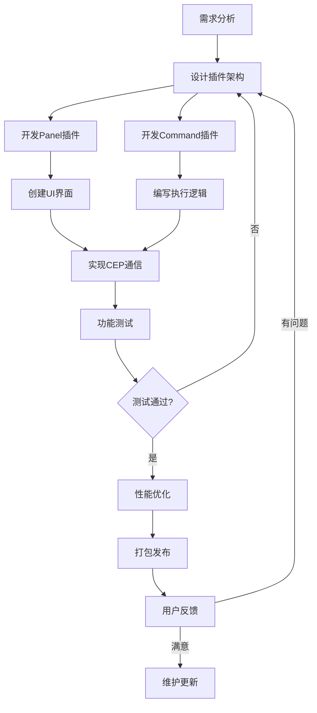
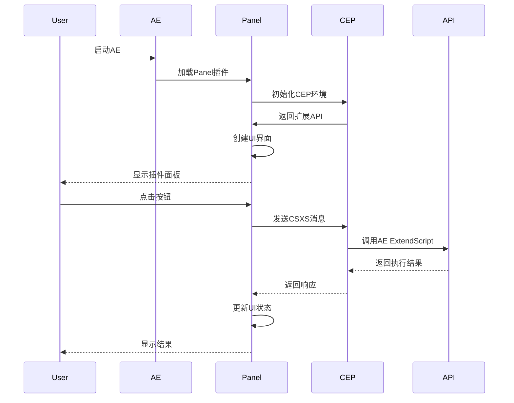
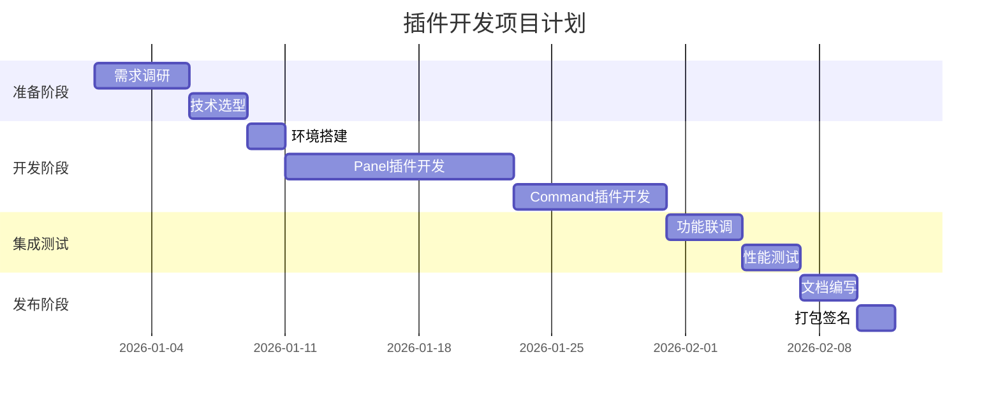
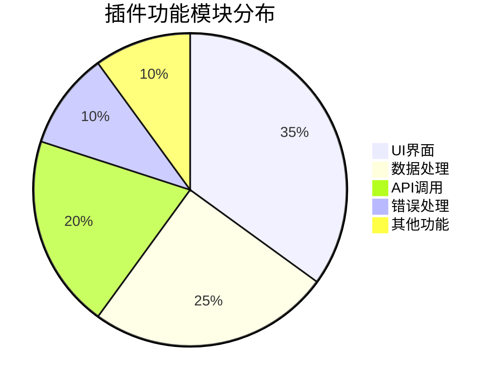

# AE扩展插件开发指南

## 插件类型

### Panel 插件

| 特点 | 描述 |
|------|------|
| 位置 | 窗口面板，可停靠 |
| 功能 | 完整的UI界面 |
| 交互 | 实时与AE通信 |
| 示例 | 工具面板、属性编辑器 |

### Command 插件

| 特点 | 描述 |
|------|------|
| 位置 | 菜单项 |
| 功能 | 单次执行命令 |
| 触发 | 菜单点击或快捷键 |
| 示例 | 批量处理、自动化任务 |

## 流程图示例

插件开发完整流程：



## 时序图示例

插件与AE交互流程：



## 甘特图示例

插件开发项目计划：



## 饼图示例

插件功能模块分布：



## 代码示例

### CEP 插件基础结构

```javascript
// manifest.xml
<?xml version="1.0" encoding="UTF-8"?>
<ExtensionManifest Version="7.0" ExtensionBundleId="com.example.ae.plugin">
    <Author>烟囱鸭</Author>
    <Version>1.0.0</Version>
    <ExtensionList>
        <Extension Id="com.example.ae.plugin.panel" Version="1.0.0">
            <HostList>
                <Host Name="AEFT" Version="[15.0,99.9]" />
            </HostList>
            <DispatchInfoList>
                <DispatchInfo>
                    <Resources>
                        <MainPath>./index.html</MainPath>
                        <ScriptPath>./hostscript.jsx</ScriptPath>
                        <CEFCommandLine>
                            <Parameter>--enable-nodejs</Parameter>
                        </CEFCommandLine>
                    </Resources>
                    <Lifecycle>
                        <AutoVisible>true</AutoVisible>
                    </Lifecycle>
                    <UI>
                        <Type>Panel</Type>
                        <Menu>My Plugin</Menu>
                        <Geometry>
                            <Size>
                                <Height>600</Height>
                                <Width>400</Width>
                            </Size>
                        </Geometry>
                        <Icons>
                            <Icon Type="Normal">./icons/normal.png</Icon>
                            <Icon Type="RollOver">./icons/rollover.png</Icon>
                            <Icon Type="Disabled">./icons/disabled.png</Icon>
                            <Icon Type="DarkNormal">./icons/darknormal.png</Icon>
                        </Icons>
                    </UI>
                </DispatchInfo>
            </DispatchInfoList>
        </Extension>
    </ExtensionList>
</ExtensionManifest>
```

### Host Script (hostscript.jsx)

```javascript
// hostscript.jsx - ExtendScript 端
{
    // CSXS 接口
    function CSInterface() {}
    CSInterface.prototype.evalScript = function(script) {
        return eval(script);
    }
    
    // 导出函数给前端调用
    var csInterface = new CSInterface();
    
    // 获取当前项目
    function getProject() {
        var project = app.project;
        if (!project) {
            return JSON.stringify({ error: "没有打开的项目" });
        }
        
        var activeItem = project.activeItem;
        return JSON.stringify({
            name: project.name,
            activeItem: activeItem ? activeItem.name : null
        });
    }
    
    // 创建合成
    function createComp(name, width, height, duration, frameRate) {
        var project = app.project;
        var folder = project.items.addFolder(name);
        var comp = project.items.addComp(name, width, height, 1, duration, frameRate);
        comp.parentFolder = folder;
        
        return JSON.stringify({
            success: true,
            compName: comp.name
        });
    }
    
    // 获取选中图层
    function getSelectedLayers() {
        var comp = app.project.activeItem;
        if (!(comp && comp instanceof CompItem)) {
            return JSON.stringify({ error: "没有选中的合成" });
        }
        
        var selectedLayers = comp.selectedLayers;
        var layerData = [];
        
        for (var i = 0; i < selectedLayers.length; i++) {
            var layer = selectedLayers[i];
            layerData.push({
                name: layer.name,
                type: layer.type,
                inPoint: layer.inPoint,
                outPoint: layer.outPoint
            });
        }
        
        return JSON.stringify({ layers: layerData });
    }
    
    // 监听前端消息
    csInterface.addEventListener("com.example.ae.plugin", function(event) {
        var message = JSON.parse(event.data);
        var result;
        
        switch (message.command) {
            case "getProject":
                result = getProject();
                break;
            case "createComp":
                result = createComp(
                    message.name,
                    message.width,
                    message.height,
                    message.duration,
                    message.frameRate
                );
                break;
            case "getSelectedLayers":
                result = getSelectedLayers();
                break;
            default:
                result = JSON.stringify({ error: "未知命令" });
        }
        
        csInterface.dispatchEvent("com.example.ae.plugin.response", result);
    });
}
```

### 前端界面 (index.html)

```html
<!DOCTYPE html>
<html>
<head>
    <meta charset="UTF-8">
    <title>AE Plugin</title>
    <style>
        * {
            margin: 0;
            padding: 0;
            box-sizing: border-box;
        }
        
        body {
            font-family: -apple-system, BlinkMacSystemFont, 'Segoe UI', sans-serif;
            background: #1e1e1e;
            color: #ffffff;
            padding: 20px;
        }
        
        .container {
            max-width: 100%;
        }
        
        .header {
            margin-bottom: 20px;
            padding-bottom: 15px;
            border-bottom: 1px solid #333;
        }
        
        .header h1 {
            font-size: 18px;
            margin-bottom: 5px;
        }
        
        .header p {
            font-size: 12px;
            color: #888;
        }
        
        .section {
            margin-bottom: 20px;
        }
        
        .section h2 {
            font-size: 14px;
            margin-bottom: 10px;
            color: #4a9eff;
        }
        
        .form-group {
            margin-bottom: 15px;
        }
        
        .form-group label {
            display: block;
            font-size: 12px;
            margin-bottom: 5px;
            color: #aaa;
        }
        
        .form-group input,
        .form-group select {
            width: 100%;
            padding: 8px;
            background: #2d2d2d;
            border: 1px solid #444;
            border-radius: 4px;
            color: #fff;
            font-size: 13px;
        }
        
        .form-group input:focus,
        .form-group select:focus {
            outline: none;
            border-color: #4a9eff;
        }
        
        .button-group {
            display: flex;
            gap: 10px;
            margin-top: 15px;
        }
        
        button {
            flex: 1;
            padding: 10px;
            background: #4a9eff;
            color: white;
            border: none;
            border-radius: 4px;
            cursor: pointer;
            font-size: 13px;
        }
        
        button:hover {
            background: #3a8eef;
        }
        
        button.secondary {
            background: #444;
        }
        
        button.secondary:hover {
            background: #555;
        }
        
        .result {
            margin-top: 20px;
            padding: 15px;
            background: #2d2d2d;
            border-radius: 4px;
            font-size: 12px;
            white-space: pre-wrap;
            word-break: break-word;
        }
        
        .loading {
            text-align: center;
            padding: 20px;
            color: #888;
        }
    </style>
</head>
<body>
    <div class="container">
        <div class="header">
            <h1>AE 工具插件</h1>
            <p>Version 1.0.0</p>
        </div>
        
        <div class="section">
            <h2>项目管理</h2>
            <div class="form-group">
                <button id="getProjectBtn">获取当前项目</button>
            </div>
            <div class="form-group">
                <label>项目名称</label>
                <input type="text" id="compName" placeholder="输入合成名称">
            </div>
            <div class="button-group">
                <button id="createCompBtn">创建合成</button>
            </div>
        </div>
        
        <div class="section">
            <h2>图层管理</h2>
            <div class="form-group">
                <button id="getLayersBtn">获取选中图层</button>
            </div>
        </div>
        
        <div class="result" id="result">
            <p>等待操作...</p>
        </div>
    </div>
    
    <script src="js/CSInterface.js"></script>
    <script src="js/main.js"></script>
</body>
</html>
```

### 主逻辑 (main.js)

```javascript
// main.js - 前端逻辑
var csInterface = new CSInterface();

// 发送消息到 ExtendScript
function sendToHost(command, data, callback) {
    var message = {
        command: command,
        data: data
    };
    
    var messageId = "msg_" + Date.now();
    csInterface.evalScript(
        JSON.stringify(message),
        function(response) {
            if (callback) {
                try {
                    var result = JSON.parse(response);
                    callback(result);
                } catch (error) {
                    callback({ error: "解析响应失败" });
                }
            }
        }
    );
}

// 显示结果
function showResult(result) {
    var resultDiv = document.getElementById("result");
    if (result.error) {
        resultDiv.innerHTML = '<p style="color: #ff6b6b;">错误: ' + result.error + '</p>';
    } else {
        resultDiv.innerHTML = '<p style="color: #4a9eff;">' + JSON.stringify(result, null, 2) + '</p>';
    }
}

// 获取当前项目
document.getElementById("getProjectBtn").addEventListener("click", function() {
    showResult({ loading: true });
    document.getElementById("result").innerHTML = '<p class="loading">加载中...</p>';
    
    sendToHost("getProject", null, function(result) {
        showResult(result);
    });
});

// 创建合成
document.getElementById("createCompBtn").addEventListener("click", function() {
    var compName = document.getElementById("compName").value || "新合成";
    
    showResult({ loading: true });
    document.getElementById("result").innerHTML = '<p class="loading">创建中...</p>';
    
    var data = {
        name: compName,
        width: 1920,
        height: 1080,
        duration: 5,
        frameRate: 30
    };
    
    sendToHost("createComp", data, function(result) {
        showResult(result);
    });
});

// 获取选中图层
document.getElementById("getLayersBtn").addEventListener("click", function() {
    showResult({ loading: true });
    document.getElementById("result").innerHTML = '<p class="loading">加载中...</p>';
    
    sendToHost("getSelectedLayers", null, function(result) {
        showResult(result);
    });
});

// 监听来自 ExtendScript 的响应
csInterface.addEventListener("com.example.ae.plugin.response", function(event) {
    try {
        var result = JSON.parse(event.data);
        showResult(result);
    } catch (error) {
        showResult({ error: "解析响应失败" });
    }
});
```

### Command 插件示例

```typescript
// command-menu.jsx - 菜单命令插件
{
    function main() {
        var comp = app.project.activeItem;
        
        if (!(comp && comp instanceof CompItem)) {
            alert("请先选择一个合成");
            return;
        }
        
        var layers = comp.selectedLayers;
        
        if (layers.length === 0) {
            alert("请先选择一个或多个图层");
            return;
        }
        
        app.beginUndoGroup("批量重命名图层");
        
        var prefix = prompt("请输入前缀:", "Layer");
        if (prefix === null) {
            app.endUndoGroup();
            return;
        }
        
        var count = 0;
        for (var i = 0; i < layers.length; i++) {
            var layer = layers[i];
            layer.name = prefix + "_" + count.toString().padStart(3, "0");
            count++;
        }
        
        app.endUndoGroup();
        
        alert("成功重命名 " + count + " 个图层");
    }
    
    main();
}
```

### 高级功能：批量处理

```javascript
// batch-process.jsx - 批量处理工具
{
    function batchProcess() {
        var comp = app.project.activeItem;
        
        if (!(comp && comp instanceof CompItem)) {
            alert("请选择一个合成");
            return;
        }
        
        var layers = comp.layers;
        var totalCount = 0;
        var successCount = 0;
        
        app.beginUndoGroup("批量处理");
        
        for (var i = 1; i <= layers.length; i++) {
            var layer = layers[i];
            
            if (layer && layer instanceof AVLayer) {
                totalCount++;
                
                try {
                    // 处理逻辑
                    processLayer(layer);
                    successCount++;
                } catch (error) {
                    console.warn("处理图层失败: " + layer.name);
                }
            }
        }
        
        app.endUndoGroup();
        
        var message = 
            "处理完成\n" +
            "总数: " + totalCount + "\n" +
            "成功: " + successCount + "\n" +
            "失败: " + (totalCount - successCount);
        
        alert(message);
    }
    
    function processLayer(layer) {
        // 获取图层的所有属性
        var props = layer.property("ADBE Transform Group");
        
        // 重置位置
        var posProp = props.property("ADBE Position");
        posProp.setValue([960, 540]);
        
        // 重置缩放
        var scaleProp = props.property("ADBE Scale");
        scaleProp.setValue([100, 100, 100]);
        
        // 重置旋转
        var rotProp = props.property("ADBE Rotation");
        rotProp.setValue(0);
        
        // 重置不透明度
        var opProp = props.property("ADBE Opacity");
        opProp.setValue(100);
        
        // 删除所有关键帧
        for (var i = 1; i <= props.numProperties; i++) {
            var prop = props.property(i);
            if (prop.canSetExpression) {
                prop.expression = "";
            }
            
            for (var j = prop.numKeys; j >= 1; j--) {
                prop.removeKey(j);
            }
        }
    }
    
    batchProcess();
}
```

### 自定义UI组件

```javascript
// 自定义对话框
function createCustomDialog() {
    var dialog = new Window("dialog", "自定义对话框", undefined, {
        resizeable: true
    });
    
    dialog.orientation = "column";
    dialog.alignChildren = ["fill", "top"];
    
    // 添加标题
    var titleGroup = dialog.add("group");
    titleGroup.alignment = ["center", "center"];
    var title = titleGroup.add("statictext", undefined, "设置面板");
    title.graphics.font = ScriptUIVersion >= 2 ? "bold" : "bold";
    
    // 添加选项卡
    var tabPanel = dialog.add("panel");
    tabPanel.alignment = ["fill", "fill"];
    
    // 添加Tab控件
    var tabs = tabPanel.add("tabbedpanel");
    tabs.alignment = ["fill", "fill"];
    
    // Tab 1: 基本设置
    var tab1 = tabs.add("tab", undefined, "基本设置");
    tab1.orientation = "column";
    tab1.alignChildren = ["left", "top"];
    
    // Tab 2: 高级设置
    var tab2 = tabs.add("tab", undefined, "高级设置");
    tab2.orientation = "column";
    tab2.alignChildren = ["left", "top"];
    
    // 添加表单元素
    tab1.add("statictext", undefined, "名称:");
    var nameInput = tab1.add("edittext", undefined, "");
    nameInput.characters = 30;
    
    tab1.add("statictext", undefined, "宽度:");
    var widthInput = tab1.add("edittext", undefined, "1920");
    
    tab1.add("statictext", undefined, "高度:");
    var heightInput = tab1.add("edittext", undefined, "1080");
    
    // 添加复选框
    tab1.add("checkbox", undefined, "启用动画");
    tab1.add("checkbox", undefined, "应用缓动");
    
    // 添加下拉列表
    tab2.add("statictext", undefined, "动画类型:");
    var animType = tab2.add("dropdownlist", undefined, ["无", "淡入", "滑动", "缩放"]);
    
    tab2.add("statictext", undefined, "缓动函数:");
    var easing = tab2.add("dropdownlist", undefined, ["线性", "缓入", "缓出", "缓入缓出"]);
    
    // 添加按钮
    var buttonGroup = dialog.add("group");
    buttonGroup.alignment = ["center", "center"];
    
    var okBtn = buttonGroup.add("button", undefined, "确定");
    var cancelBtn = buttonGroup.add("button", undefined, "取消");
    
    // 按钮事件
    okBtn.onClick = function() {
        var settings = {
            name: nameInput.text,
            width: parseInt(widthInput.text),
            height: parseInt(heightInput.text),
            animation: animType.selection,
            easing: easing.selection
        };
        
        applySettings(settings);
        dialog.close();
    };
    
    cancelBtn.onClick = function() {
        dialog.close();
    };
    
    dialog.layout.layout(true);
    dialog.show();
}
```

## 调试技巧

### Chrome 开发者工具

```javascript
// 在 CEP 插件中使用 Chrome DevTools
csInterface.setPanelFlyoutVisible(true);

// 打开开发者工具
csInterface.openURLInDefaultBrowser("chrome://inspect");

// 使用 console.log
console.log("调试信息:", data);
```

### 错误日志

```javascript
// 日志收集
var logFile = new File("~/Desktop/plugin_log.txt");
logFile.encoding = "UTF-8";

function log(message) {
    var timestamp = new Date().toLocaleString();
    var logMessage = "[" + timestamp + "] " + message + "\n";
    logFile.open("a");
    logFile.write(logMessage);
    logFile.close();
}

// 使用
log("插件启动");
log("执行命令: " + command);
```

## 发布流程

### 1. 准备打包文件

```
plugin-package/
├── CEP/
│   ├── CSXS/
│   │   └── manifest.xml
│   ├── index.html
│   ├── js/
│   │   ├── CSInterface.js
│   │   └── main.js
│   └── hostscript.jsx
├── scripts/
│   └── command-menu.jsx
└── resources/
    └── icons/
```

### 2. 签名插件

```bash
# 使用 ZXPSignCmd 签名
ZXPSignCmd -sign "plugin-package" cert.pem cert password

# 验证签名
ZXPSignCmd -verify "plugin-package.zxp"
```

### 3. 分发安装

```javascript
// 安装脚本
var installer = {
    checkCompatibility: function() {
        var aeVersion = parseFloat(app.version);
        return aeVersion >= 15.0;
    },
    
    install: function(packagePath) {
        if (!this.checkCompatibility()) {
            alert("不兼容的AE版本");
            return false;
        }
        
        // 调用系统安装程序
        var installPath = Folder.startup.path;
        var success = File(packagePath).copy(installPath + "/Extensions/");
        
        return success;
    }
};
```

## 最佳实践

1. **代码组织**
   - 模块化设计
   - 清晰的命名规范
   - 充分的注释说明

2. **用户体验**
   - 友好的界面设计
   - 清晰的操作提示
   - 进度反馈

3. **性能优化**
   - 减少不必要的计算
   - 使用缓存机制
   - 优化API调用

4. **错误处理**
   - 完善的异常捕获
   - 友好的错误提示
   - 日志记录

## 总结

通过本指南，你已经掌握了：

- ✅ CEP 插件开发基础
- ✅ Panel 和 Command 插件
- ✅ ExtendScript 通信
- ✅ 自定义UI界面
- ✅ 高级功能实现
- ✅ 调试和发布流程

---

**作者**: 烟囱鸭  
**更新时间**: 2026-02-05  
**版本**: 1.0.0
