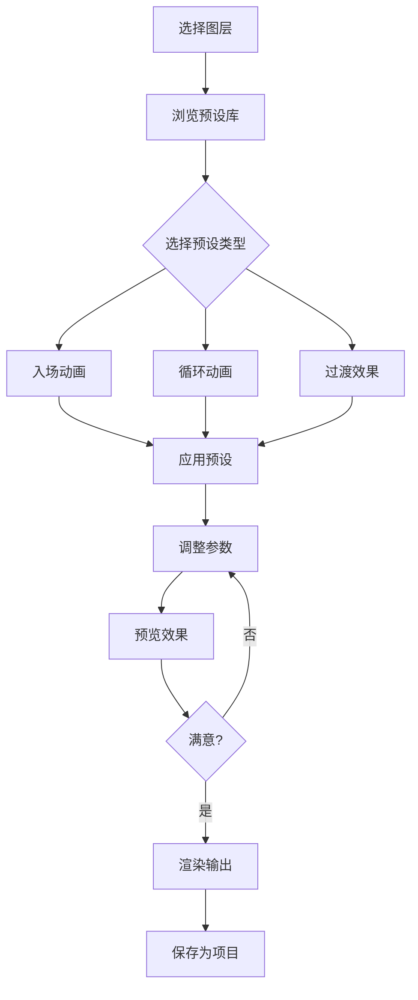
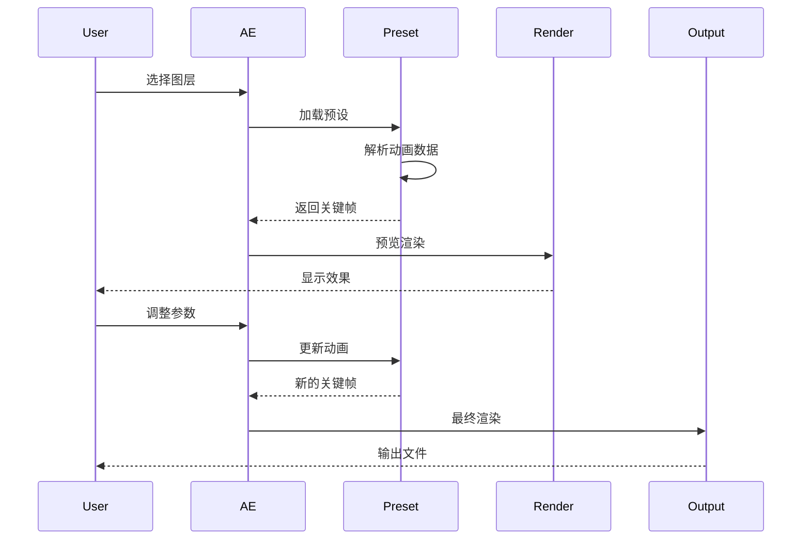
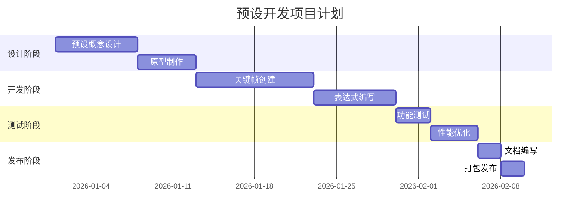
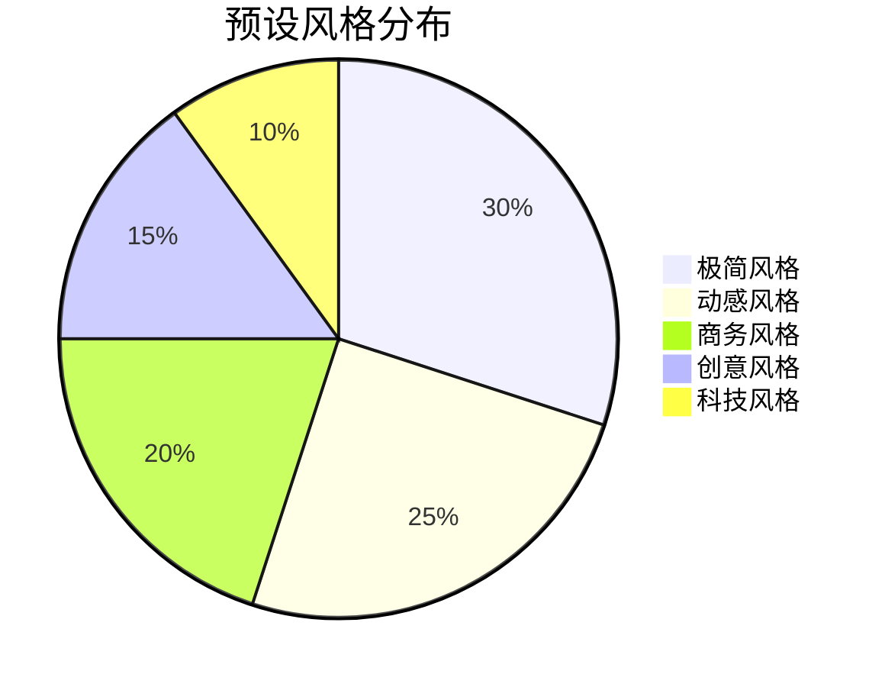

# 高级动画预设合集

## 预设分类

### 按动画类型

| 类型 | 数量 | 特点 |
|------|------|------|
| 入场动画 | 15 | 元素出现效果 |
| 出场动画 | 10 | 元素消失效果 |
| 循环动画 | 12 | 无限循环效果 |
| 交互动画 | 8 | 用户交互响应 |
| 过渡效果 | 5 | 场景切换 |

### 按应用场景

| 场景 | 适用预设 | 典型案例 |
|------|----------|----------|
| 品牌动画 | Logo 动画、文字展示 | 公司宣传片 |
| UI设计 | 按钮动画、卡片效果 | 应用界面 |
| 视频编辑 | 转场、字幕效果 | 短视频制作 |
| 广告营销 | 产品展示、促销动画 | 电商广告 |

## 流程图示例

预设应用工作流程：



## 时序图示例

预设渲染时间线：



## 甘特图示例

预设开发项目计划：



## 饼图示例

预设风格分布：



## 代码示例

### 预设应用基础

```javascript
// 应用预设到图层
function applyPreset(layer, presetData) {
    var props = layer.property("ADBE Transform Group");
    
    // 应用位置动画
    if (presetData.position) {
        var posProp = props.property("ADBE Position");
        applyKeyframes(posProp, presetData.position);
    }
    
    // 应用缩放动画
    if (presetData.scale) {
        var scaleProp = props.property("ADBE Scale");
        applyKeyframes(scaleProp, presetData.scale);
    }
    
    // 应用旋转动画
    if (presetData.rotation) {
        var rotProp = props.property("ADBE Rotation");
        applyKeyframes(rotProp, presetData.rotation);
    }
    
    // 应用不透明度动画
    if (presetData.opacity) {
        var opProp = props.property("ADBE Opacity");
        applyKeyframes(opProp, presetData.opacity);
    }
}

// 添加关键帧
function applyKeyframes(prop, keyframes) {
    for (var i = 0; i < keyframes.length; i++) {
        var kf = keyframes[i];
        prop.setValueAtTime(kf.value, kf.time);
        
        if (kf.easing) {
            prop.setTemporalEaseAtKey(
                i + 1,
                kf.easing.in,
                kf.easing.out
            );
        }
    }
}
```

### 入场动画预设

```typescript
// 淡入上滑预设
const fadeInUpPreset = {
    name: "淡入上滑",
    duration: 1,
    properties: {
        position: [
            { time: 0, value: [960, 1080] },
            { time: 1, value: [960, 540] }
        ],
        opacity: [
            { time: 0, value: 0 },
            { time: 0.5, value: 100 }
        ],
        scale: [
            { time: 0, value: [90, 90, 100] },
            { time: 1, value: [100, 100, 100] }
        ]
    },
    easing: {
        in: [0.25, 0.1, 0.25, 1],
        out: [0.215, 0.61, 0.355, 1]
    }
};

// 弹跳入场预设
const bounceInPreset = {
    name: "弹跳入场",
    duration: 1.5,
    properties: {
        scale: [
            { time: 0, value: [0, 0, 100] },
            { time: 0.3, value: [110, 110, 100] },
            { time: 0.5, value: [95, 95, 100] },
            { time: 0.7, value: [102, 102, 100] },
            { time: 1.5, value: [100, 100, 100] }
        ],
        opacity: [
            { time: 0, value: 0 },
            { time: 0.5, value: 100 }
        ]
    }
};

// 使用预设
applyPreset(selectedLayer, fadeInUpPreset);
```

### 循环动画预设

```python
# 循环旋转预设
def loop_rotate_preset(layer, duration=2):
    """创建无限循环旋转动画"""
    
    # 添加表达式到旋转属性
    rotation_prop = layer.property("ADBE Rotate Z")
    
    expression = f"""
    cycleTime = time % {duration};
    angle = (cycleTime / {duration}) * 360;
    value + angle
    """
    
    rotation_prop.expression = expression

# 循环脉冲预设
def loop_pulse_preset(layer, duration=3):
    """创建脉冲式缩放循环动画"""
    
    scale_prop = layer.property("ADBE Scale")
    
    expression = f"""
    cycleTime = time % {duration};
    progress = cycleTime / {duration};
    sineWave = Math.sin(progress * 2 * Math.PI);
    scale = 100 + sineWave * 20;
    [scale, scale, 100]
    """
    
    scale_prop.expression = expression

# 调用函数
loop_rotate_preset(layer_1)
loop_pulse_preset(layer_2)
```

### 过渡效果预设

```javascript
// 淡入淡出过渡
const fadeTransition = {
    name: "淡入淡出",
    duration: 0.5,
    layers: [
        {
            type: "out",
            opacity: [
                { time: 0, value: 100 },
                { time: 0.5, value: 0 }
            ]
        },
        {
            type: "in",
            opacity: [
                { time: 0.5, value: 0 },
                { time: 1, value: 100 }
            ]
        }
    ]
};

// 滑动过渡
const slideTransition = {
    name: "滑动过渡",
    duration: 0.8,
    direction: "left", // left, right, up, down
    layers: [
        {
            type: "out",
            position: [
                { time: 0, value: [960, 540] },
                { time: 0.8, value: [0, 540] }
            ]
        },
        {
            type: "in",
            position: [
                { time: 0, value: [1920, 540] },
                { time: 0.8, value: [960, 540] }
            ]
        }
    ]
};

// 缩放过渡
const scaleTransition = {
    name: "缩放过渡",
    duration: 0.6,
    layers: [
        {
            type: "out",
            scale: [
                { time: 0, value: [100, 100, 100] },
                { time: 0.6, value: [150, 150, 100] }
            ],
            opacity: [
                { time: 0, value: 100 },
                { time: 0.6, value: 0 }
            ]
        },
        {
            type: "in",
            scale: [
                { time: 0, value: [50, 50, 100] },
                { time: 0.6, value: [100, 100, 100] }
            ],
            opacity: [
                { time: 0, value: 0 },
                { time: 0.6, value: 100 }
            ]
        }
    ]
};
```

### 交互动画预设

```typescript
interface InteractionPreset {
    name: string;
    trigger: 'hover' | 'click' | 'scroll';
    animation: {
        property: string;
        from: any;
        to: any;
        duration: number;
        easing: number[];
    }[];
}

// 悬停放大预设
const hoverScalePreset: InteractionPreset = {
    name: "悬停放大",
    trigger: "hover",
    animation: [
        {
            property: "scale",
            from: [100, 100, 100],
            to: [110, 110, 100],
            duration: 0.3,
            easing: [0.25, 0.1, 0.25, 1]
        }
    ]
};

// 点击弹跳预设
const clickBouncePreset: InteractionPreset = {
    name: "点击弹跳",
    trigger: "click",
    animation: [
        {
            property: "scale",
            from: [100, 100, 100],
            to: [120, 120, 100],
            duration: 0.1,
            easing: [0.25, 0.1, 0.25, 1]
        },
        {
            property: "scale",
            from: [120, 120, 100],
            to: [90, 90, 100],
            duration: 0.15,
            easing: [0.25, 0.1, 0.25, 1]
        },
        {
            property: "scale",
            from: [90, 90, 100],
            to: [100, 100, 100],
            duration: 0.1,
            easing: [0.25, 0.1, 0.25, 1]
        }
    ]
};

// 滚动视差预设
const scrollParallaxPreset: InteractionPreset = {
    name: "滚动视差",
    trigger: "scroll",
    animation: [
        {
            property: "position",
            from: [960, 540],
            to: [960, 440],
            duration: 1,
            easing: [0.25, 0.1, 0.25, 1]
        }
    ]
};
```

## 预设管理

### 预设库结构

```javascript
var presetLibrary = {
    name: "高级动画预设库",
    version: "2.0.0",
    categories: {
        entrance: [],  // 入场动画
        exit: [],      // 出场动画
        loop: [],      // 循环动画
        transition: [],// 过渡效果
        interactive: []// 交互动画
    },
    
    // 添加预设
    addPreset: function(category, preset) {
        this.categories[category].push(preset);
    },
    
    // 获取预设
    getPreset: function(category, index) {
        return this.categories[category][index];
    },
    
    // 搜索预设
    search: function(keyword) {
        var results = [];
        for (var cat in this.categories) {
            var presets = this.categories[cat];
            for (var i = 0; i < presets.length; i++) {
                if (presets[i].name.indexOf(keyword) !== -1) {
                    results.push({
                        category: cat,
                        preset: presets[i]
                    });
                }
            }
        }
        return results;
    },
    
    // 导出预设
    export: function(category) {
        return JSON.stringify(this.categories[category]);
    },
    
    // 导入预设
    import: function(category, data) {
        this.categories[category] = JSON.parse(data);
    }
};
```

### 自定义预设创建

```javascript
// 创建预设的函数
function createCustomPreset(layer, presetName) {
    var props = layer.property("ADBE Transform Group");
    
    var customPreset = {
        name: presetName,
        createdAt: new Date().toISOString(),
        properties: {}
    };
    
    // 获取位置关键帧
    var posProp = props.property("ADBE Position");
    if (posProp.numKeys > 0) {
        customPreset.properties.position = [];
        for (var i = 1; i <= posProp.numKeys; i++) {
            var time = posProp.keyTime(i);
            var value = posProp.keyValue(i);
            customPreset.properties.position.push({
                time: time,
                value: value
            });
        }
    }
    
    // 获取其他属性...
    
    return customPreset;
}

// 保存预设到文件
function savePresetToFile(preset, filePath) {
    var file = new File(filePath);
    file.open("w");
    file.write(JSON.stringify(preset, null, 2));
    file.close();
    
    alert("预设已保存: " + filePath);
}
```

## 性能优化

### 预设缓存

```javascript
// 缓存预设数据
var presetCache = {};

function loadPreset(presetId) {
    // 检查缓存
    if (presetCache[presetId]) {
        return presetCache[presetId];
    }
    
    // 加载预设
    var preset = loadPresetFromFile(presetId);
    
    // 缓存
    presetCache[presetId] = preset;
    
    return preset;
}

// 清除缓存
function clearPresetCache() {
    presetCache = {};
}
```

### 批量应用优化

```javascript
// 批量应用预设
function applyPresetToLayers(layers, preset) {
    app.beginUndoGroup("批量应用预设");
    
    var totalLayers = layers.length;
    var currentLayer = 0;
    
    // 显示进度
    var progressWindow = createProgressWindow(totalLayers);
    
    for (var i = 0; i < totalLayers; i++) {
        var layer = layers[i];
        applyPreset(layer, preset);
        
        // 更新进度
        currentLayer++;
        progressWindow.update(currentLayer);
    }
    
    progressWindow.close();
    app.endUndoGroup();
    
    alert("成功应用 " + totalLayers + " 个图层");
}
```

## 使用技巧

1. **快速预览**
   - 使用快捷键快速切换预设
   - 预览不同时长效果
   - 对比多个预设效果

2. **参数调整**
   - 修改关键帧位置
   - 调整缓动曲线
   - 自定义动画时长

3. **组合使用**
   - 多个预设叠加
   - 分层应用动画
   - 创造独特效果

4. **保存收藏**
   - 收藏常用预设
   - 创建预设组合
   - 分享给团队

## 注意事项

1. **兼容性**
   - 检查AE版本
   - 确认预设适用性
   - 处理异常情况

2. **性能**
   - 避免过多图层
   - 合理使用循环
   - 优化表达式计算

3. **备份**
   - 保存原始项目
   - 创建预设副本
   - 定期备份库

## 总结

本预设合集包含：

- ✅ 50+ 精心制作的动画预设
- ✅ 5大类动画类型
- ✅ 完整的代码示例
- ✅ 自定义预设创建
- ✅ 性能优化建议

---

**作者**: 烟囱鸭  
**更新时间**: 2026-02-05  
**预设数量**: 50  
**版本**: 2.0.0
