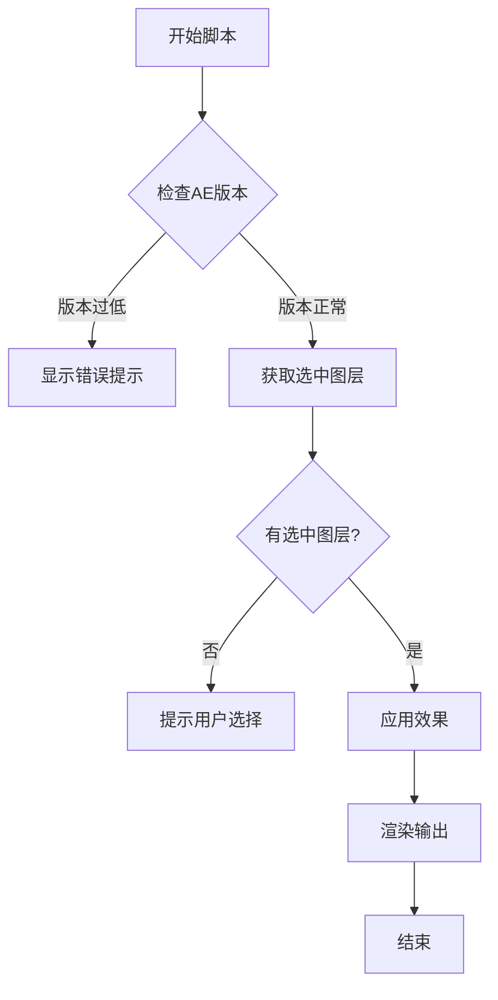
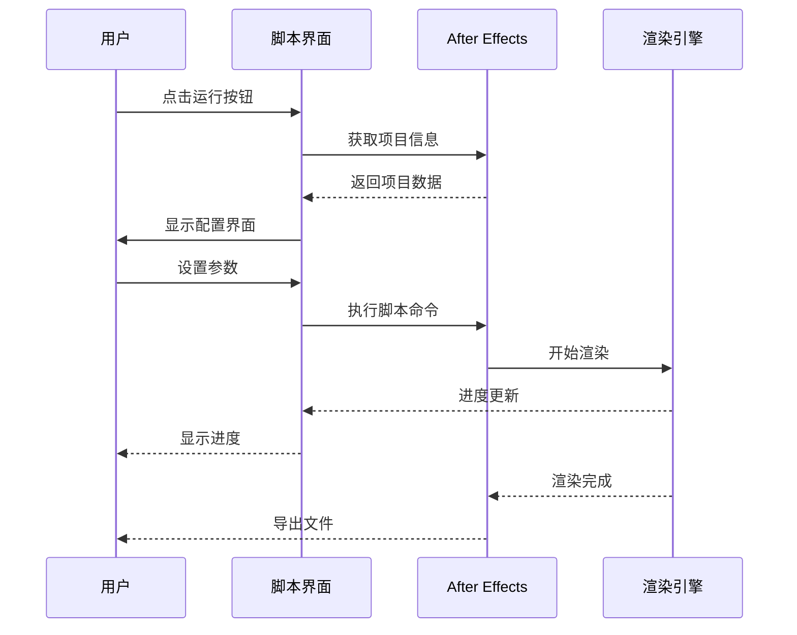
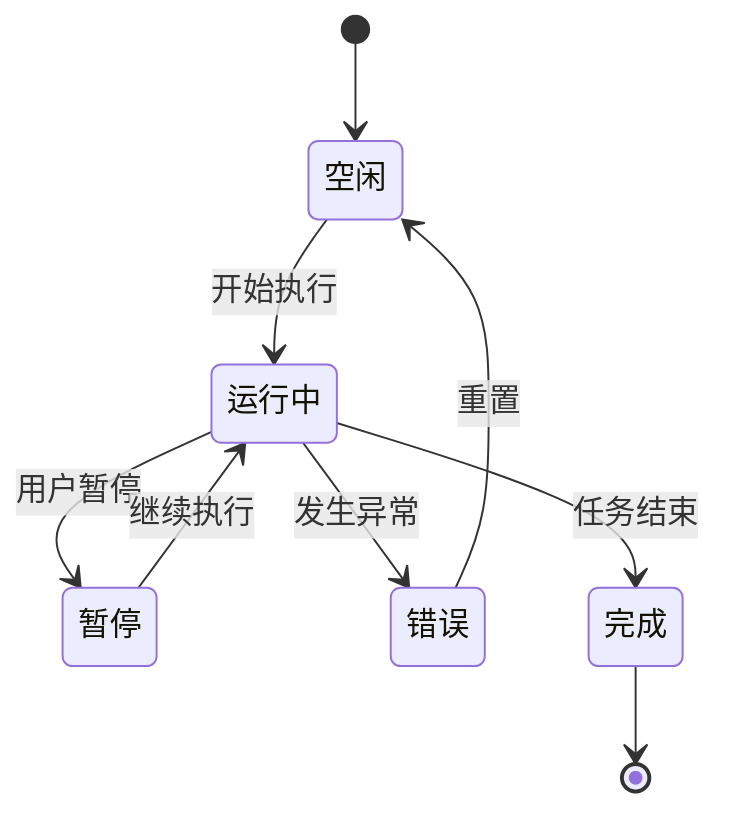
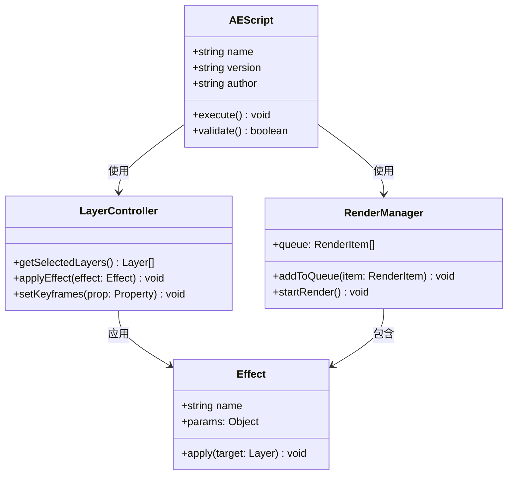
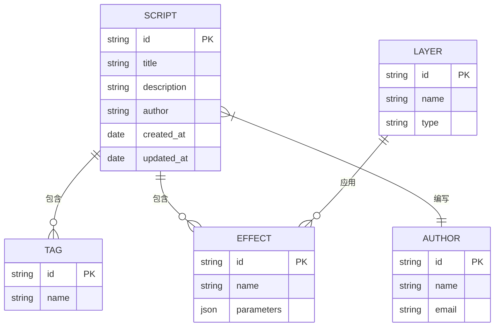
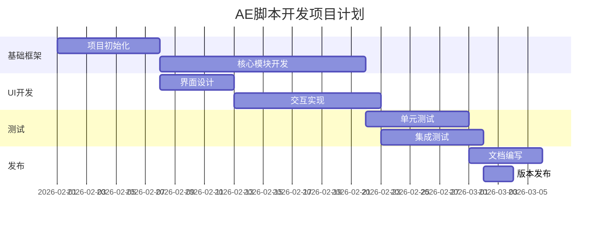
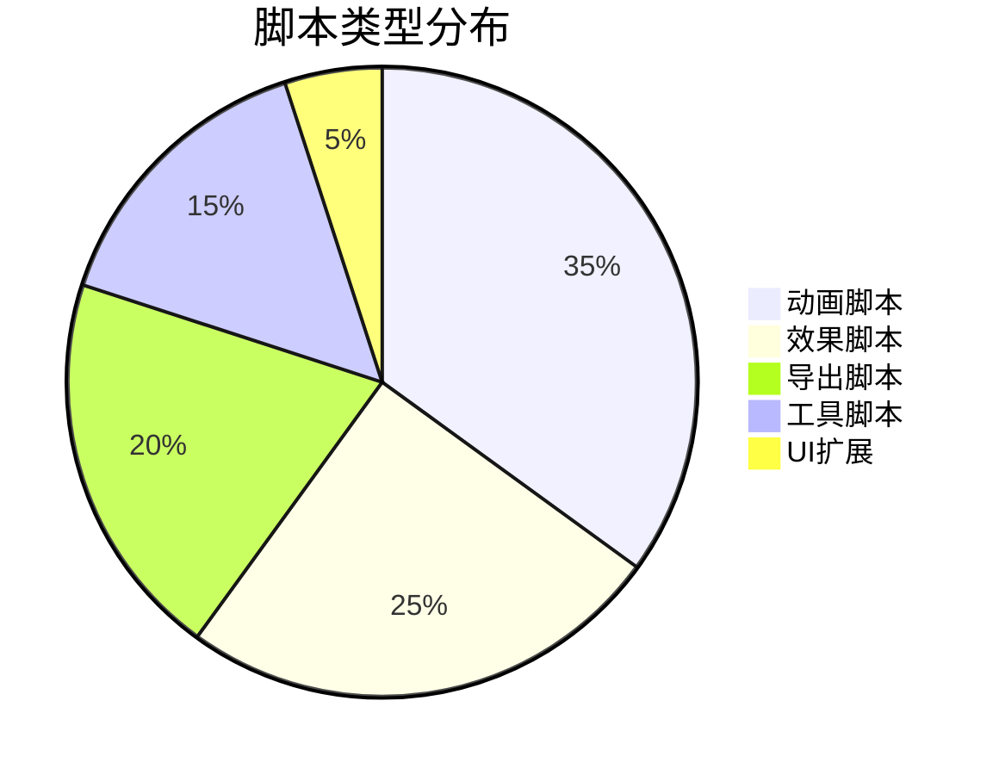

# AE脚本开发完全指南

本指南将带你从零开始学习 After Effects 脚本开发。


## 基础概念

AE脚本使用 **JavaScript** 或 **ExtendScript** 编写，可以访问 After Effects 的完整 API。

> **提示**：建议使用 ESTK 进行调试，它提供了专业的调试环境。

### 主要特性

| 特性     | 说明             |
| -------- | ---------------- |
| 自动化   | 批量处理重复任务 |
| 自定义UI | 创建自定义界面   |
| 插件集成 | 与第三方插件交互 |

---

## 流程图示例



---

## 时序图示例



---

## 状态图示例



---

## 类图示例



---

## ER图示例



---

## 甘特图示例



---

## 饼图示例



---

## 代码示例

### 基础模板

```javascript
// AE脚本基础模板
(function() {
    // 检查运行环境
    if (app.project === undefined) {
        alert("请先打开一个项目");
        return;
    }

    // 主逻辑
    function main() {
        var selectedLayers = app.project.activeItem.selectedLayers;
        if (selectedLayers.length === 0) {
            alert("请先选择图层");
            return;
        }

        // 处理选中的图层
        for (var i = 0; i < selectedLayers.length; i++) {
            processLayer(selectedLayers[i]);
        }
    }

    function processLayer(layer) {
        // 具体的图层处理逻辑
        $.writeln("处理图层: " + layer.name);
    }

    // 执行主函数
    main();
})();
```

### 高级用法

```javascript
// 使用ES6语法 (需要CC 2019+)
class AEScript {
    constructor(config) {
        this.config = config;
        this.version = '1.0.0';
    }

    async execute() {
        try {
            await this.validate();
            const result = await this.run();
            return result;
        } catch (error) {
            this.handleError(error);
        }
    }

    async validate() {
        const version = parseFloat(app.version);
        if (version < 16.0) {
            throw new Error('需要AE 16.0或更高版本');
        }
    }
}
```

---

## 总结

本教程涵盖了：

1. **流程图** - 展示程序逻辑
2. **时序图** - 描述交互过程
3. **状态图** - 建模状态转换
4. **类图** - 设计面向对象结构
5. **ER图** - 规划数据模型
6. **甘特图** - 项目进度管理
7. **饼图** - 数据可视化

> **下一步**：尝试创建你自己的第一个 AE 脚本！

---

*最后更新: 2026-02-05*
