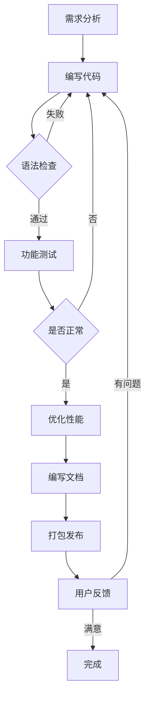
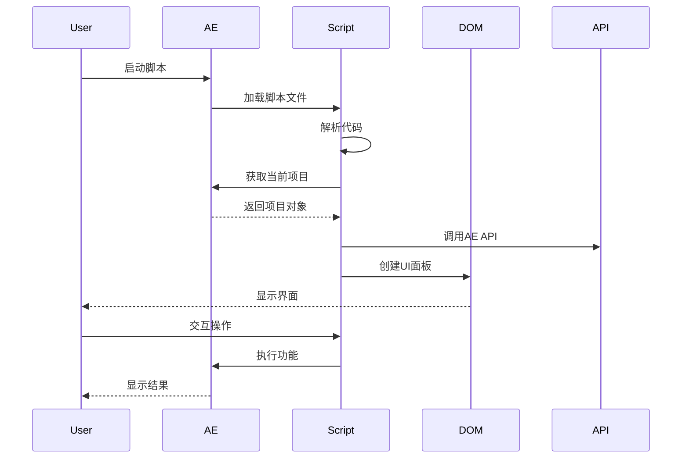
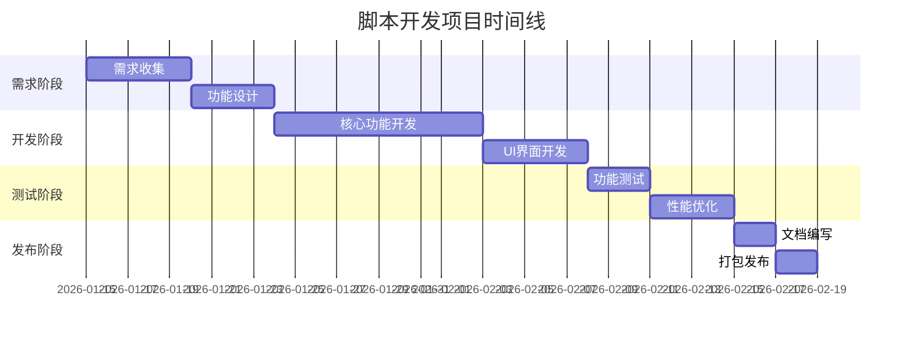
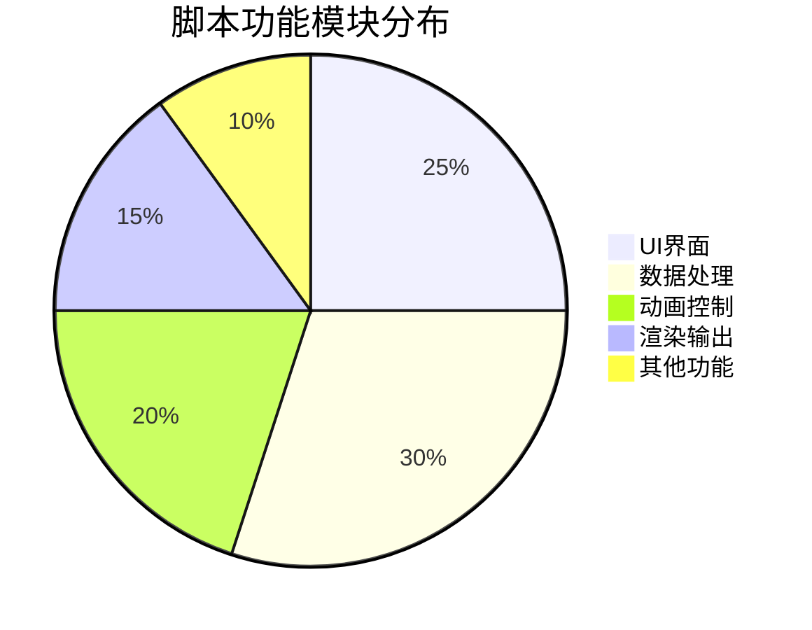

# AE脚本开发完全指南

## 基础概念

After Effects脚本是基于ExtendScript（JavaScript的扩展版本）编写的，可以自动化执行各种任务。

### 脚本类型

| 类型 | 文件扩展名 | 特点 |
|------|------------|------|
| JSX脚本 | .jsx | 完整功能，可访问所有API |
| UX脚本 | .jsxbin | 编译后的脚本 |
| 表达式引擎 | .jsx | 仅限表达式使用 |

### 开发环境搭建

```javascript
// VS Code + Adobe ExtendScript 插件
// 或使用 Adobe ExtendScript Toolkit CC

// 基础脚本结构
{
    function myScript(thisObj) {
        app.beginUndoGroup("My Script");
        
        // 脚本逻辑
        
        app.endUndoGroup();
    }
    
    myScript(this);
}
```

## 流程图示例

脚本开发完整流程：



## 时序图示例

脚本执行与交互流程：



## 甘特图示例

脚本开发项目时间线：



## 饼图示例

脚本功能模块分布：



## 代码示例

### 基础操作

```javascript
// 获取当前合成
var comp = app.project.activeItem;

if (comp && comp instanceof CompItem) {
    // 获取选中的图层
    var selectedLayers = comp.selectedLayers;
    
    // 遍历图层
    for (var i = 0; i < selectedLayers.length; i++) {
        var layer = selectedLayers[i];
        // 执行操作
    }
}
```

### 创建脚本面板

```javascript
{
    function buildUI(thisObj) {
        var win = (thisObj instanceof Panel) ? thisObj : new Window("palette", "My Script", undefined, {resizeable:true});
        
        win.orientation = "column";
        win.alignChildren = ["fill", "top"];
        win.spacing = 10;
        win.margins = 16;
        
        // 添加标题
        var titleGroup = win.add("group");
        titleGroup.alignment = ["center", "center"];
        var title = titleGroup.add("statictext", undefined, "AE脚本工具");
        title.graphics.font = ScriptUIVersion >= 2 ? "bold" : "bold";
        
        // 添加按钮
        var btnGroup = win.add("group");
        btnGroup.alignment = ["center", "center"];
        var runBtn = btnGroup.add("button", undefined, "运行脚本");
        var resetBtn = btnGroup.add("button", undefined, "重置");
        
        // 添加进度条
        var progressGroup = win.add("group");
        progressGroup.alignment = ["fill", "center"];
        var progress = progressGroup.add("progressbar", undefined, 0, 100);
        
        runBtn.onClick = function() {
            // 执行脚本逻辑
        };
        
        resetBtn.onClick = function() {
            progress.value = 0;
        };
        
        win.layout.layout(true);
        return win;
    }
    
    var myScriptPal = buildUI(this);
    
    if (myScriptPal instanceof Window) {
        myScriptPal.center();
        myScriptPal.show();
    }
}
```

### 图层批量处理

```typescript
// 批量重命名图层
function renameLayers(prefix) {
    var comp = app.project.activeItem;
    if (!(comp && comp instanceof CompItem)) {
        alert("请选择一个合成");
        return;
    }
    
    app.beginUndoGroup("重命名图层");
    
    var layers = comp.layers;
    var count = 0;
    
    for (var i = 1; i <= layers.length; i++) {
        var layer = layers[i];
        if (layer !== null && layer instanceof AVLayer) {
            layer.name = prefix + "_" + count.toString().padStart(3, "0");
            count++;
        }
    }
    
    app.endUndoGroup();
    alert("成功重命名 " + count + " 个图层");
}

// 调用函数
renameLayers("Layer");
```

### 关键帧操作

```python
# 添加关键帧
def add_keyframes(layer, property_name, times, values):
    prop = layer.property(property_name)
    prop.setValuesAtTimes(values, times)

# 示例
layer = comp.layer(1)
times = [0, 1, 2, 3]
values = [0, 100, 50, 100]
add_keyframes(layer, "opacity", times, values)

# 缓动关键帧
def ease_keyframes(layer, property_name):
    prop = layer.property(property_name)
    for i in range(1, prop.numKeys):
        prop.setInterpolationTypeAtKey(i, KeyframeInterpolationType.BEZIER)
        prop.setTemporalEaseAtKey(i, [0.5, 0.5], [0.5, 0.5])
```

### 表达式应用

```javascript
// 添加表达式到属性
function applyExpression(layer, property, expression) {
    var prop = layer.property(property);
    if (prop.canSetExpression) {
        prop.expression = expression;
    }
}

// 往复运动表达式
var bounceExpression = 
    "amp = 50;" +
    "freq = 2;" +
    "decay = 3;" +
    "t = time - inPoint;" +
    "y = amp * Math.sin(t * freq * 2 * Math.PI) / Math.exp(t * decay);" +
    "value + [0, y]";

// 应用到位置属性
applyExpression(selectedLayers[0], "ADBE Position", bounceExpression);
```

### 批量渲染

```javascript
// 队列渲染设置
function setupRenderQueue() {
    var queue = app.project.renderQueue;
    
    // 遍历队列中的项目
    for (var i = 1; i <= queue.numItems; i++) {
        var item = queue.item(i);
        var comp = item.comp;
        
        // 设置输出模块
        var outputModule = item.getSettings(FileSource.RENDER_QUEUE);
        
        // 设置输出路径
        var outputPath = "~/Desktop/Render/" + comp.name;
        outputModule.outputFilePath = new File(outputPath);
        
        // 设置格式
        outputModule.fileFormat = "quicktime";
        outputModule.videoFormat = "H.264";
        
        // 设置分辨率
        item.timeSpanStart = 0;
        item.timeSpanDuration = comp.duration;
    }
}

// 开始渲染
function startRender() {
    var queue = app.project.renderQueue;
    queue.render();
}

// 执行
setupRenderQueue();
startRender();
```

## 错误处理

### try-catch 模式

```javascript
try {
    // 可能出错的代码
    var comp = app.project.activeItem;
    
    if (!comp) {
        throw new Error("没有选中的合成");
    }
    
    // 执行操作
    
} catch (error) {
    // 错误处理
    alert("发生错误: " + error.toString());
    console.error(error);
} finally {
    // 清理工作
    app.endUndoGroup();
}
```

### 验证输入

```javascript
// 验证图层选择
function validateLayerSelection() {
    var comp = app.project.activeItem;
    
    if (!(comp && comp instanceof CompItem)) {
        return { valid: false, message: "请选择一个合成" };
    }
    
    var selectedLayers = comp.selectedLayers;
    if (selectedLayers.length === 0) {
        return { valid: false, message: "请至少选择一个图层" };
    }
    
    return { valid: true };
}

// 使用示例
var validation = validateLayerSelection();
if (!validation.valid) {
    alert(validation.message);
    return;
}
```

## 性能优化

### 避免频繁DOM操作

```javascript
// 不好的做法：循环中重复查询
for (var i = 0; i < layers.length; i++) {
    var layer = app.project.activeItem.layer(i);
    // 操作图层
}

// 好的做法：提前获取引用
var comp = app.project.activeItem;
var layers = comp.layers;
for (var i = 1; i <= layers.length; i++) {
    var layer = layers[i];
    // 操作图层
}
```

### 使用批处理

```javascript
app.beginUndoGroup("批量操作");

try {
    // 所有操作在一次撤销组中
    
} catch (error) {
    alert("操作失败: " + error.message);
    
} finally {
    app.endUndoGroup();
}
```

## 调试技巧

### 日志输出

```javascript
// 简单日志
$.writeln("调试信息: " + variable);

// 格式化日志
function log(message, data) {
    var timestamp = new Date().toLocaleTimeString();
    $.writeln("[" + timestamp + "] " + message);
    if (data) {
        $.writeln("  " + JSON.stringify(data));
    }
}

// 使用
log("处理图层", { name: "Layer 1", type: "shape" });
```

### 断点调试

```javascript
// 使用 alert 作为断点
function debugBreak() {
    if (confirm("断点：继续执行？")) {
        return;
    }
    throw new Error("用户中断");
}

// 在关键位置使用
debugBreak();
```

## 发布流程

### 打包脚本

```javascript
// 使用 ESTK Toolkit
// 或使用第三方工具如 .jsxbin 编译器

// 清理和优化代码
// 添加使用说明
// 准备图标和资源文件
```

### 版本管理

```javascript
// 在脚本中添加版本信息
var SCRIPT_VERSION = "1.0.0";
var SCRIPT_AUTHOR = "Your Name";
var SCRIPT_DESCRIPTION = "Script Description";

// 显示版本信息
function showVersion() {
    var message = 
        "脚本名称: " + SCRIPT_NAME + "\n" +
        "版本号: " + SCRIPT_VERSION + "\n" +
        "作者: " + SCRIPT_AUTHOR + "\n" +
        "描述: " + SCRIPT_DESCRIPTION;
    
    alert(message);
}
```

## 最佳实践

1. **代码组织**
   - 使用函数模块化
   - 添加清晰的注释
   - 遵循命名规范

2. **用户体验**
   - 提供进度反馈
   - 添加撤销支持
   - 错误提示友好

3. **性能考虑**
   - 避免不必要的计算
   - 批量操作减少API调用
   - 使用缓存优化

4. **兼容性**
   - 检查AE版本
   - 处理不同语言环境
   - 提供降级方案

## 总结

通过本教程，你已经掌握了：

- ✅ AE脚本开发基础
- ✅ UI界面创建
- ✅ 图层和属性操作
- ✅ 表达式应用
- ✅ 错误处理和调试
- ✅ 性能优化技巧
- ✅ 发布和版本管理

---

**作者**: 烟囱鸭  
**更新时间**: 2026-02-05  
**版本**: 1.0.0
