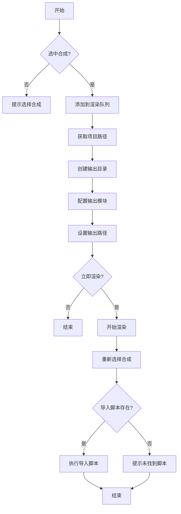

## 下载

🔗 [add_to_render_queue.jsx](https://github.com/yancongya/AE----/releases/download/v1.0.0/add_to_render_queue.jsx)

**文件信息：**
- 文件大小：约 2 KB
- 版本：v1.0.0
- 兼容性：AE CC 2018+
- 类型：自动化脚本

## 使用场景

- 快速将当前合成添加到渲染队列
- 自动创建项目文件夹同名的输出目录
- 自动配置序列帧输出模块
- 渲染完成后自动导入序列帧
- 批量渲染多个合成时提高效率

## 功能特性

### 核心功能

| 功能 | 说明 |
|------|------|
| 添加到队列 | 一键将当前合成添加到渲染队列 |
| 自动创建目录 | 在项目文件夹下创建以合成名称命名的输出目录 |
| 配置输出模块 | 自动应用"序列帧"输出模块模板 |
| 自动渲染 | 可选择立即开始渲染 |
| 自动导入 | 渲染完成后自动调用导入序列帧独显脚本 |

### 高级功能

- 智能路径管理：基于项目路径自动生成输出路径
- 输出文件命名：使用 `合成名_[#####]` 格式支持多帧
- 错误处理：项目未保存或未选择合成时给出提示
- 脚本联动：渲染后自动执行关联的导入脚本

## 原理分析

### 架构设计

脚本通过以下步骤实现自动化渲染：

1. 获取当前激活的合成
2. 将合成添加到渲染队列
3. 基于项目路径创建输出目录
4. 配置输出模块和文件路径
5. 询问用户是否立即渲染
6. 渲染完成后执行导入序列帧脚本

### 关键函数

#### 获取当前合成

```javascript
var comp = app.project.activeItem;
if (comp != null && comp instanceof CompItem) {
    // 处理逻辑
}
```

**说明：** 确保当前选中的是合成对象

#### 添加到渲染队列

```javascript
var renderQueue = app.project.renderQueue;
var renderItem = renderQueue.items.add(comp);
```

**说明：** 将合成添加到渲染队列并获取渲染项

#### 创建输出目录

```javascript
var projectFile = app.project.file;
var projectFolder = projectFile.parent;
var outputFolder = new Folder(projectFolder.fsName + "/" + comp.name);

if (!outputFolder.exists) {
    outputFolder.create();
}
```

**说明：** 在项目文件夹下创建以合成名称命名的输出目录

#### 配置输出模块

```javascript
var outputModule = renderItem.outputModule(1);
outputModule.applyTemplate("序列帧");

var outputFileName = comp.name + "_[#####]";
var outputFile = new File(outputFolder.fsName + "/" + outputFileName);
outputModule.file = outputFile;
```

**说明：** 应用"序列帧"模板并设置输出路径和文件名

#### 自动渲染和导入

```javascript
var doRender = confirm("是否立即开始渲染？");
if (doRender) {
    renderQueue.render();
    
    // 渲染完成后重新选择原始合成
    comp.openInViewer();
    
    // 执行导入序列帧独显脚本
    var currentScript = new File($.fileName);
    var scriptFolder = currentScript.parent;
    var importScript = new File(scriptFolder.fsName + "/导入序列帧独显.jsx");
    
    if (importScript.exists) {
        importScript.open("r");
        var scriptContent = importScript.read();
        importScript.close();
        eval(scriptContent);
    }
}
```

**说明：** 渲染完成后自动导入渲染的序列帧

### 数据流程



## 使用教程

### 步骤 1：安装

1. 下载 `add_to_render_queue.jsx` 脚本文件
2. 复制到 AE 脚本目录：
   - Windows: `C:\Program Files\Adobe\Adobe After Effects [版本]\Support Files\Scripts\ScriptUI Panels\`
   - macOS: `/Applications/Adobe After Effects [版本]/Scripts/ScriptUI Panels/`
3. 重启 After Effects

### 步骤 2：准备

1. 打开 After Effects 项目
2. 确保项目已保存（脚本需要项目路径）
3. 选择要渲染的合成

### 步骤 3：运行

1. 选择 Window → 添加到渲染队列
2. 脚本自动执行以下操作：
   - 将合成添加到渲染队列
   - 在项目文件夹下创建输出目录
   - 配置序列帧输出模块
   - 弹出确认对话框
3. 点击"确定"开始渲染

### 步骤 4：渲染后

渲染完成后脚本会：
1. 重新选择原始合成
2. 自动调用"导入序列帧独显.jsx"脚本
3. 导入渲染的序列帧到项目中

## 注意事项

> ⚠️ **注意**：
> - 项目必须先保存，脚本需要获取项目路径
> - 必须选择一个合成才能运行
> - 确保项目目录有写入权限
> - 确保"导入序列帧独显.jsx"脚本在同一目录下
> - 输出模块模板名称为"序列帧"，如需修改请调整脚本

## 常见问题

### Q: 脚本提示"请先选择一个合成"？

**A:** 确保在运行脚本前已经选择了一个合成，而不是文件夹或其他类型的项目项。

### Q: 输出目录创建失败？

**A:** 检查项目文件夹是否有写入权限，确保路径中没有特殊字符。

### Q: 渲染完成后没有自动导入序列帧？

**A:** 检查"导入序列帧独显.jsx"脚本是否在同一目录下，且文件名完全匹配。

### Q: 可以自定义输出模块模板吗？

**A:** 可以，修改脚本中的 `outputModule.applyTemplate("序列帧")` 为你需要的模板名称。

### Q: 输出文件名格式可以修改吗？

**A:** 可以，修改 `comp.name + "_[#####]"` 为你需要的格式，`[#####]` 是帧数占位符。

## 更新日志

- v1.0.0 (2026-02-06)：初始版本

## 相关脚本

- [旋转适配工具集](./rotate-and-fit)
- [AE脚本开发完全指南](./ae-script-guide)