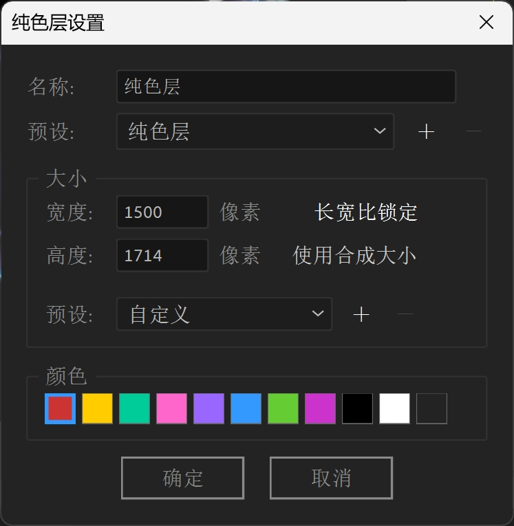
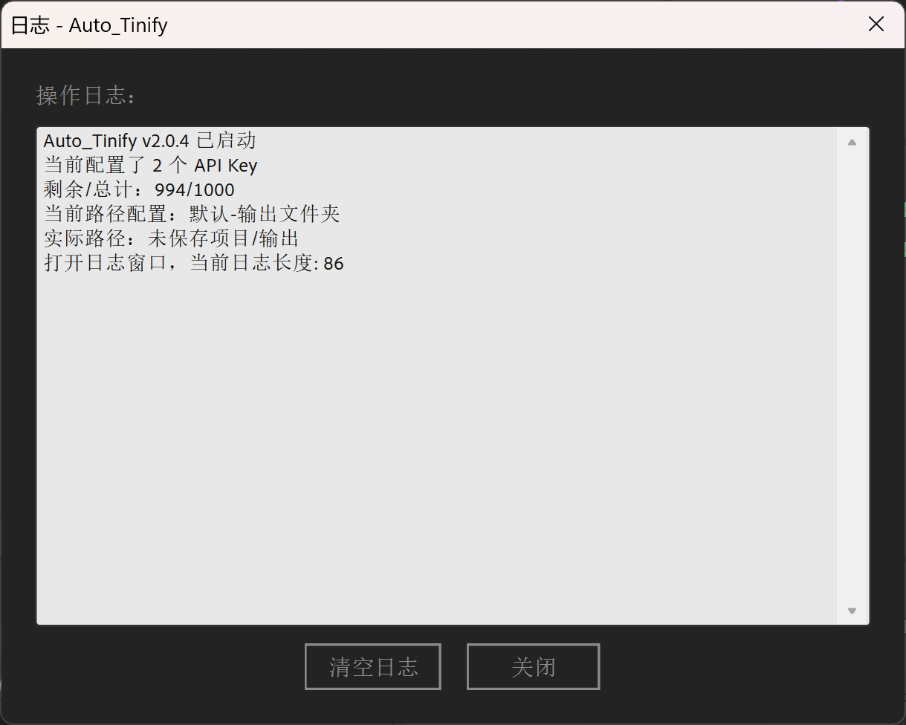

## 介绍

Auto_Tinify 是一款专为 After Effects 设计的图片压缩工具，通过 Tinify API 提供高效、智能的图片压缩服务。支持批量压缩、多 API Key 轮换、自定义路径配置等强大功能，帮助您轻松优化项目中的图片资源。

## 产品官网

🌐 [产品官网](https://yancongya.github.io/auto_tinify/) | 📦 [下载安装](https://github.com/yancongya/auto_tinify/tree/main/public) | 🐙 [仓库地址](https://github.com/yancongya/auto_tinify)

## 下载

### 安装方法

**方法 1：手动安装**

1. 下载 `public` 文件夹中的最新版本 `.jsxbin` 文件
   - 网盘下载：[123网盘下载](https://www.123865.com/s/FQvajv-z4EnH?pwd=zIXS)
2. 复制到 After Effects 脚本目录：
   - **Windows**: `C:\Program Files\Adobe\Adobe After Effects [版本]\Support Files\Scripts\`
   - **Mac**: `/Applications/Adobe After Effects [版本]/Scripts/`
3. 重启 After Effects，在 `Window` 菜单中找到脚本

**方法 2：使用脚本面板**

1. 在 After Effects 中，选择 `Window` → `Extensions` → `Extensions ScriptUI Panels`
2. 拖拽 `.jsxbin` 文件到脚本面板

**方法 3：使用 kbar 脚本管理器（强烈推荐）**

1. 安装 [kbar](https://kbar.itycon.cn/) 脚本管理器
2. 在 kbar 中搜索 `Auto_Tinify`
3. 点击安装即可

> 💡 **推荐使用方法 3**，kbar 会自动处理安装路径和版本更新，省时省力。

## 使用场景

- **项目交付前**：快速压缩输出图片，减小文件体积，方便传输
- **客户沟通**：图片太大无法发送？一键压缩解决
- **素材整理**：批量压缩整理素材库，节省存储空间

## 功能特性

### 主要特点

- 🧠 **智能压缩**：使用 Tinify API 压缩图片（JPG、PNG、WebP），压缩率高达 70%，画质几乎无损
- 🔑 **多密钥支持**：支持多个 API Key 轮换，自动追踪剩余次数
- 🎯 **灵活路径**：支持路径配置，使用 `${projectPath}` 变量
- ⚡ **快捷操作**：
  - `Ctrl+Shift` 点击：压缩选中的图片文件
  - `Alt` 点击：直接替换原图
- 📊 **实时监控**：显示剩余使用次数和当前路径
- 📝 **日志记录**：完整的操作日志记录
- 💾 **配置持久化**：自动保存配置文件，无需重复设置
- 📁 **项目集成**：直接在 AE 项目中选择图片进行压缩

### 快捷操作

| 操作 | 方法 | 说明 |
|------|------|------|
| 压缩选中项目中的图片文件 | `Ctrl+Shift` + 点击 | 仅压缩选中的图片文件 |
| 直接替换原图 | `Alt` + 点击 | 用于压缩后直接替换原文件 |
| 查看日志 | 点击 `📋` 按钮 | 查看详细操作记录 |
| 查看帮助 | 点击 `?` 按钮 | 查看使用说明 |

## 界面展示

### 主界面



- **状态栏**：显示剩余次数和当前压缩路径
- **压缩进度**：实时显示压缩进度

### 日志面板



## 原理分析

### 架构设计

Auto_Tinify 采用模块化设计，主要包含以下模块：

```
┌─────────────────┐
│   主界面模块     │  ← 用户交互入口（ScriptUI）
└────────┬────────┘
         │
    ┌────▼────┐
    │ API管理  │  ← Key轮换、次数追踪
    └────┬────┘
         │
    ┌────▼────┐
    │ 路径解析 │  ← ${projectPath} 变量处理
    └────┬────┘
         │
    ┌────▼────┐
    │ 压缩引擎 │  ← 调用 Tinify API
    └─────────┘
```

### 关键函数

#### API Key 管理

```javascript
// 配置存储格式：key:xxx,yyy (API Key + 剩余次数)
function loadApiKeys() {
    // 从配置文件读取 API Key 列表
    // 自动跳过已用完的 Key
}

function rotateApiKey() {
    // 轮换到下一个可用的 API Key
    // 记录当前 Key 的剩余次数
}
```

#### 路径解析

```javascript
// 支持 ${projectPath} 变量
function resolvePath(pathPattern, projectPath) {
    return pathPattern.replace('${projectPath}', projectPath);
}

// 支持正则表达式控制压缩目录
function matchFiles(directory, pattern) {
    // 根据正则表达式匹配需要压缩的图片文件
}
```

#### 图片压缩

```javascript
// 调用 Tinify API 压缩图片
function compressImage(filePath, apiKey) {
    // 使用 curl 调用 Tinify HTTPS API
    // 处理 JPG、PNG、WebP 格式
}
```

### 数据流程

```
用户点击压缩
    ↓
读取配置文件 (auto_tinify_config.txt)
    ↓
解析路径变量 ${projectPath}
    ↓
扫描匹配的图片文件
    ↓
轮换 API Key
    ↓
调用 Tinify API 压缩
    ↓
保存压缩结果到临时文件夹
    ↓
(可选) 替换原文件
    ↓
更新剩余次数
    ↓
记录日志
```

## 使用教程

### 步骤 1：获取 API Key

1. 访问 [Tinify 官网](https://tinify.com/developers) 注册账号
2. 获取免费 API Key（每月 500 次免费额度）
3. 如需更多额度，可注册多个账号配置多个 Key

### 步骤 2：配置

- **API Key 设置**：点击主面板 `⚙ API Key 设置` 按钮，添加你的 API Key
- **路径配置**：点击 `⚙ 路径设置` 按钮，配置要压缩的图片路径
- 所有配置都会保存在脚本旁边的配置文件中，方便随时备份

### 步骤 3：配置压缩路径

支持正则表达式进行控制需要自动压缩的目录：

- `${projectPath}`：项目文件所在的父目录

**路径示例：**

| 路径模式 | 说明 |
|----------|------|
| `${projectPath}/输出` | 压缩项目目录旁的"输出"文件夹中的图片 |
| `${projectPath}/compressed` | 压缩项目目录旁的"compressed"文件夹中的图片 |
| `D:/MyProject/images` | 绝对路径（指定要压缩的图片目录） |

### 步骤 4：开始压缩

- 点击 `开始压缩` 按钮即可
- 默认模式：压缩到临时文件夹，压缩完成后需要点击"替换"按钮将文件复制到原目录
- `Alt` + 点击 `开始压缩`：直接替换原文件（会弹出确认对话框防止误操作）

## 配置说明

### API Key 管理

- **添加**：点击 `API Key 设置` → `添加 API Key` → 输入 Key → `确定`
- **查看剩余次数**：状态栏显示格式 `剩余 995/1000 | 路径：xxx`
- **删除**：在列表中选中 Key → 点击 `删除`
- **刷新次数**：点击 `刷新次数` 按钮查看每个 API Key 的剩余情况

### 配置文件

所有配置自动保存在 `auto_tinify_config.txt`（脚本同目录），包括：

- API Key 及剩余次数（格式：`key:xxx,yyy`）
- 路径配置（格式：`名称|路径模式`）

```
key:your_api_key_here,495
默认-输出文件夹|${projectPath}/输出
```

## 注意事项

> ⚠️ **注意**：本工具需要 Tinify API Key 才能使用，请遵守 Tinify 的服务条款

> ⚠️ **重要**：压缩前建议备份原文件，特别是使用 `Alt` + 点击直接替换模式时

## 常见问题

### Q: 压缩失败怎么办？

**A:** 请检查：
1. API Key 是否有效
2. 网络连接是否正常
3. 图片格式是否支持（JPG、PNG、WebP）

### Q: 免费额度用完了怎么办？

**A:** 可以在 [Tinify 定价页面](https://tinify.com/pricing) 查看付费方案，或注册新账号获取新 Key

### Q: 支持哪些图片格式？

**A:** JPG、PNG、WebP

### Q: 可以批量压缩多个项目吗？

**A:** 可以，脚本会根据当前项目的 `${projectPath}` 自动调整压缩路径

### Q: 如何获取更多免费额度？

**A:** 注册多个 Tinify 账号，在 API Key 设置中添加多个 Key，脚本会自动轮换使用，每月最多可用 2500 次（5 个 Key）

## 技术支持

- 📖 [Tinify API 文档](https://tinify.com/developers/reference)
- 🐛 [GitHub Issues](https://github.com/yancongya/auto_tinify/issues)

## 许可证

MIT License

## 支持作者

如果这个脚本对你有帮助，欢迎请作者喝杯咖啡 ☕️

 

---

## 更新日志

### v2.0.4（最新版本）

- 设置窗口重大改版：拆分为 API Key 设置窗口和路径配置窗口
- 主面板按钮优化：拆分为两个独立按钮
- 路径配置 UI 优化：删除冗余标题，界面更简洁
- 中文文件名支持修复：使用 `decodeURI()` 正确解码
- 配置文件存储优化：统一使用 `auto_tinify_config.txt`
- 状态栏显示优化：显示剩余次数和当前路径
- 窗口类型优化：主窗口改为非模态面板

### v2.0.3

- 新增多 API Key 支持
- API Key 轮换使用
- 剩余次数追踪
- 配置文件格式更新

### v2.0.2

- UI 重大重构
- 新增设置对话框
- 日志功能优化

### v2.0

- 重大更新：使用 Tinify API 直接压缩
- API Key 配置功能
- 两种压缩模式

### v1.x

- 基础功能实现
- 依赖外部 tiny.exe