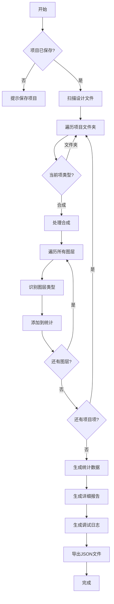

## 下载

🔗 [layer_analysis.jsx](https://github.com/yancongya/AE----/releases/download/v1.0.0/layer_analysis.jsx)

**文件信息：**
- 文件大小：约 8 KB
- 版本：v1.0.0
- 兼容性：AE CC 2018+
- 类型：分析工具

## 使用场景

- 分析项目中使用的素材类型和数量
- 统计设计文件（PSD、AI、Sketch等）的使用情况
- 检查视频、音频、图片资源的分布
- 项目清理和优化前的资产盘点
- 项目交接时的资产清单生成

## 功能特性

### 核心功能

| 功能 | 说明 |
|------|------|
| 视频图层 | 识别MP4、MOV等视频文件 |
| 图片图层 | 识别JPG、PNG等图片文件 |
| 音频图层 | 识别WAV、MP3等音频文件 |
| 序列帧 | 识别图片序列文件 |
| 设计文件 | 识别PSD、AI、Sketch等设计源文件 |
| 形状图层 | 识别矢量形状图层 |
| 文本图层 | 识别文字图层 |
| 预合成 | 识别嵌套合成 |
| 素材统计 | 按文件类型统计所有素材 |

### 高级功能

- 递归扫描：遍历所有文件夹和合成
- 智能识别：根据文件扩展名和属性判断图层类型
- 设计文件关联：识别预合成是否来自设计文件
- 序列帧检测：识别图片序列命名模式
- 详细调试信息：生成完整的分类过程日志
- JSON导出：输出结构化的统计数据

## 原理分析

### 架构设计

脚本通过以下步骤实现图层分析：

1. 扫描项目中的设计文件
2. 遍历所有文件夹和合成
3. 识别每个图层的类型
4. 统计各类型图层的数量
5. 生成统计报告和调试日志
6. 导出JSON文件到项目目录

### 关键函数

#### 扫描设计文件

```javascript
function scanDesignFiles() {
    for (var i = 1; i <= project.numItems; i++) {
        var item = project.item(i);
        if (item instanceof FootageItem && item.mainSource instanceof FileSource && item.file) {
            var fileName = item.file.name.toLowerCase();
            var designPattern = /\.(ai|psd|psb|eps|indd|sketch|fig|xd|afdesign|afphoto|xcf|cdr|svg|pdf)$/;
            if (fileName.match(designPattern)) {
                designFileNames[baseName.toLowerCase()] = decodedFileName;
            }
        }
    }
}
```

**说明：** 预先扫描项目中的设计文件，用于后续识别预合成来源

#### 获取图层类型

```javascript
function getLayerType(layer) {
    switch (layer.matchName) {
        case "ADBE Vector Layer":
            return "shapeLayer";
        case "ADBE Text Layer":
            return "textLayer";
        case "ADBE Camera Layer":
            return "cameraLayer";
        case "ADBE Light Layer":
            return "lightLayer";
        case "ADBE AV Layer":
            if (layer.nullLayer === true) {
                return "nullSolidLayer";
            } else if (layer.adjustmentLayer === true) {
                return "adjustmentLayer";
            } else if (layer.source instanceof CompItem) {
                // 检查是否来自设计文件
                var isDesignFilePrecomp = /* 检查逻辑 */;
                return isDesignFilePrecomp ? "designFile" : "precomp";
            } else if (layer.source instanceof FootageItem) {
                var source = layer.source.mainSource;
                // 详细判断视频、音频、图片、序列帧等
                return /* 对应类型 */;
            }
    }
    return "other";
}
```

**说明：** 根据图层的 matchName 和属性判断具体类型

#### 递归遍历

```javascript
function traverseFolder(folder) {
    for (var i = 1; i <= folder.numItems; i++) {
        var item = folder.item(i);
        if (item instanceof FolderItem) {
            traverseFolder(item);
        } else if (item instanceof CompItem) {
            processComposition(item);
        }
    }
}
```

**说明：** 递归遍历文件夹结构，处理所有合成

#### 生成报告

```javascript
var statisticsData = {};
var detailsData = {};

for (var type in layerStats) {
    if (layerStats[type].length > 0) {
        statisticsData[type] = layerStats[type].length;
        detailsData[type] = layerStats[type];
    }
}

var statsFile = new File(projectPath + "\\" + projectName + "_layer_stats.json");
statsFile.open('w');
statsFile.encoding = 'UTF-8';
statsFile.write(JSON.stringify(statisticsData, null, 2));
statsFile.close();
```

**说明：** 生成JSON格式的统计报告

### 数据流程



## 使用教程

### 步骤 1：安装

1. 下载 `layer_analysis.jsx` 脚本文件
2. 复制到 AE 脚本目录：
   - Windows: `C:\Program Files\Adobe\Adobe After Effects [版本]\Support Files\Scripts\ScriptUI Panels\`
   - macOS: `/Applications/Adobe After Effects [版本]/Scripts/ScriptUI Panels/`
3. 重启 After Effects

### 步骤 2：运行

1. 打开 After Effects 项目
2. **必须先保存项目**（脚本需要获取项目路径）
3. 选择 Window → 图层分析工具
4. 脚本自动分析所有图层的类型和数量

### 步骤 3：查看结果

脚本会在项目目录下生成三个文件：

1. **`项目名_layer_stats.json`** - 统计数据
```json
{
  "video": 15,
  "image": 42,
  "audio": 8,
  "sequence": 5,
  "designFile": 12,
  "shapeLayer": 28,
  "textLayer": 10,
  "precomp": 20,
  "sourceFiles": 87
}
```

2. **`项目名_layer_details.json`** - 详细信息
```json
{
  "video": ["scene_01.mp4", "scene_02.mp4"],
  "image": ["bg_01.jpg", "icon_01.png"],
  "sourceFiles": {
    "psd": ["design.psd", "assets.psd"],
    "ai": ["vector.ai"]
  }
}
```

3. **`项目名_layer_debug.txt`** - 调试日志
```
--- Layer: background ---
matchName: ADBE AV Layer
File Name: background.jpg
isStill: true
-> Result: image
```

### 步骤 4：分析报告

根据生成的报告文件，你可以：

- 查看项目中使用的素材类型分布
- 识别设计文件的使用情况
- 找出未使用的素材
- 统计序列帧的数量
- 优化项目文件结构

## 注意事项

> ⚠️ **注意**：
> - **必须先保存项目**，脚本需要项目路径来生成报告
> - 脚本会遍历所有文件夹和合成，大型项目可能需要一些时间
> - 生成的JSON文件使用UTF-8编码
> - 相同名称的图层只会统计一次（避免重复计数）
> - 调试日志文件可能很大，大型项目建议谨慎使用

## 常见问题

### Q: 脚本提示"项目未保存"？

**A:** 脚本需要项目路径来生成报告文件。请先保存项目（File → Save）。

### Q: 为什么某些图层被识别为"other"？

**A:** 可能是特殊类型的图层（如参考图层、3D图层等）或无法识别的素材类型。查看调试日志文件了解详细信息。

### Q: 序列帧识别不准确？

**A:** 序列帧识别基于文件命名模式（如 `image_[001-100].jpg`）。如果命名不规范，可能无法正确识别。

### Q: 设计文件预合成识别不准确？

**A:** 脚本通过比对预合成名称和设计文件名称来识别。如果名称差异较大，可能无法正确关联。

### Q: 如何只分析特定合成？

**A:** 当前版本分析所有合成。可以通过修改脚本的 `processComposition` 函数来限制范围。

### Q: 调试日志文件太大怎么办？

**A:** 可以在脚本中注释掉 `debugInfo.push()` 相关的代码行，减少日志输出。

## 更新日志

- v1.0.0 (2026-02-06)：初始版本

## 相关脚本

- [添加到渲染队列](./add-to-render-queue)
- [旋转适配工具集](./rotate-and-fit)
- [AE脚本开发完全指南](./ae-script-guide)