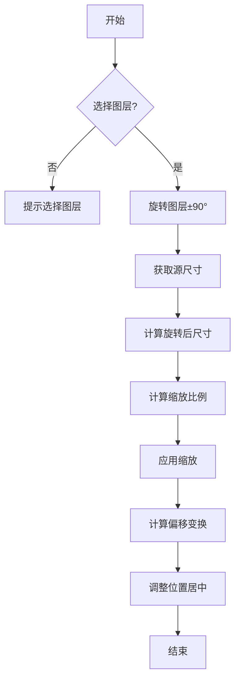

## 下载

🔗 [左转适合高度.jsx](https://github.com/yancongya/AE----/releases/download/v1.0.0/左转适合高度.jsx)

🔗 [左转适合宽度.jsx](https://github.com/yancongya/AE----/releases/download/v1.0.0/左转适合宽度.jsx)

🔗 [右转适合高度.jsx](https://github.com/yancongya/AE----/releases/download/v1.0.0/右转适合高度.jsx)

🔗 [右转适合宽度.jsx](https://github.com/yancongya/AE----/releases/download/v1.0.0/右转适合宽度.jsx)

**文件信息：**
- 文件大小：每文件约 3 KB
- 版本：v1.0.0
- 兼容性：AE CC 2018+
- 类型：自动化脚本

## 使用场景

- 将横向素材旋转为竖向后适配合成尺寸
- 将竖向素材旋转为横向后适配合成尺寸
- 批量处理多个图层的旋转和缩放
- 制作竖屏或横屏内容时快速调整素材方向
- 保持图层内容纵横比的同时适配合成

## 功能特性

### 核心功能

| 功能 | 说明 |
|------|------|
| 左转适合高度 | 向左旋转90°，按高度适配合成 |
| 左转适合宽度 | 向左旋转90°，按宽度适配合成 |
| 右转适合高度 | 向右旋转90°，按高度适配合成 |
| 右转适合宽度 | 向右旋转90°，按宽度适配合成 |

### 高级功能

- 批量处理：选中多个图层一次性处理
- 自动居中：旋转和缩放后自动居中对齐
- 撤销支持：所有操作在一个撤销组中
- 错误处理：跳过3D图层和空图层

## 原理分析

### 架构设计

脚本通过以下步骤实现旋转适配：

1. 旋转图层±90°
2. 获取旋转后的源尺寸（交换宽高）
3. 根据目标尺寸计算缩放比例
4. 应用缩放保持纵横比
5. 考虑旋转后的偏移变换进行居中对齐

### 关键函数

#### 旋转处理

```javascript
// 向左旋转90°（逆时针）
layer.property("Rotation").setValue(currentRotation - 90);

// 向右旋转90°（顺时针）
layer.property("Rotation").setValue(currentRotation + 90);
```

**说明：** 旋转角度为90°，方向取决于脚本类型

#### 尺寸计算

```javascript
var rect = layer.sourceRectAtTime(comp.time, false);
var origWidth = rect.width;
var origHeight = rect.height;

// 旋转后尺寸交换
var w2 = origHeight;  // 新的宽度
var h2 = origWidth;   // 新的高度
```

**说明：** 旋转90°后宽高互换

#### 缩放计算

```javascript
// 适合高度
var scaleFactor = (comp.height / h2) * 100;

// 适合宽度
var scaleFactor = (comp.width / w2) * 100;

layer.property("Scale").setValue([scaleFactor, scaleFactor]);
```

**说明：** 根据目标尺寸计算缩放比例，保持纵横比

#### 居中对齐

```javascript
// 计算原始内容中心相对于锚点的偏移
var deltaX = rect.left + origWidth / 2 - anchor[0];
var deltaY = rect.top + origHeight / 2 - anchor[1];

// 左转90°的偏移变换
var rotatedDeltaX = -deltaY;
var rotatedDeltaY = deltaX;

// 计算新位置
var newX = comp.width / 2 - rotatedDeltaX * (scaleFactor / 100);
var newY = comp.height / 2 - rotatedDeltaY * (scaleFactor / 100);
```

**说明：** 考虑旋转后的偏移变换，使图层内容中心与合成中心对齐

### 数据流程



## 使用教程

### 步骤 1：安装

1. 下载所需的脚本文件
2. 复制 `.jsx` 文件到 AE 脚本目录：
   - Windows: `C:\Program Files\Adobe\Adobe After Effects [版本]\Support Files\Scripts\ScriptUI Panels\`
   - macOS: `/Applications/Adobe After Effects [版本]/Scripts/ScriptUI Panels/`
3. 重启 After Effects

### 步骤 2：运行

1. 打开 After Effects 项目
2. 选择一个合成
3. 选择要处理的图层（可选多个）
4. 选择 Window → 对应的脚本名称
5. 脚本自动处理选中的图层

### 步骤 3：撤销

如果需要撤销操作：
- 按 `Ctrl+Z` (Windows) 或 `Cmd+Z` (Mac)
- 所有操作会在一个撤销组中一次性撤销

## 注意事项

> ⚠️ **注意**：
> - 必须先选择一个合成
> - 必须至少选择一个图层
> - 3D图层可能没有Rotation属性，会被跳过
> - 空图层（宽高为0）会被跳过
> - 旋转会累加到当前旋转值上

## 常见问题

### Q: 为什么图层没有旋转？

**A:** 检查图层是否为3D图层，3D图层可能没有Rotation属性。脚本会在控制台输出跳过的图层信息。

### Q: 为什么图层没有居中？

**A:** 检查图层的锚点位置。脚本使用 `sourceRectAtTime()` 获取实际内容边界，如果锚点不在内容中心，可能导致偏移。

### Q: 可以处理视频素材吗？

**A:** 可以，脚本适用于任何类型的图层，包括视频、图片、形状等。

### Q: 批量处理时出错怎么办？

**A:** 脚本会跳过有问题的图层继续处理其他图层。查看控制台（Window → Developer → JavaScript Console）获取详细信息。

## 更新日志

- v1.0.0 (2026-02-06)：初始版本，包含四个旋转适配脚本

## 相关脚本

- [AE脚本开发完全指南](./ae-script-guide)
- [脚本开发完整指南](./script-complete-guide)