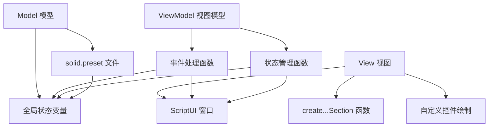
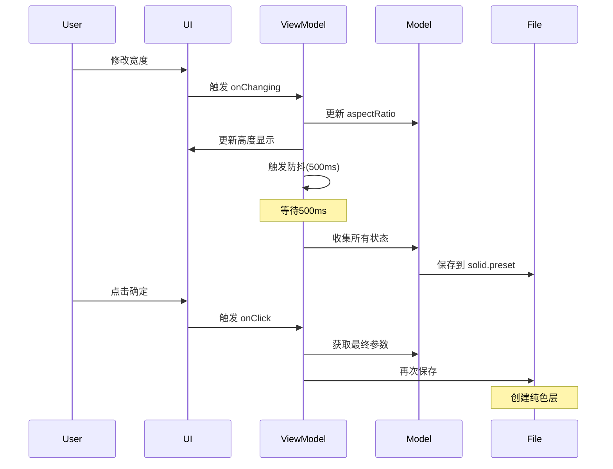

## 下载

🔗 [solid-layer-creator.jsx](https://github.com/yancongya/AE----/releases/download/v1.0.0/solid-layer-creator.jsx)

**配套文件：**
- 🔗 [solid.preset](https://github.com/yancongya/AE----/releases/download/v1.0.0/solid.preset) - 预设配置文件（可选）

**文件信息：**
- 文件大小：约 90 KB
- 版本：v1.0.0
- 兼容性：AE CC 2018+
- 类型：UI工具

## 使用场景

- 快速创建指定尺寸的纯色层
- 使用标签色板快速设置纯色层颜色
- 管理常用尺寸和名称预设
- 批量创建统一规格的纯色层
- UI设计稿快速搭建原型

## 功能特性

### 核心功能

| 功能 | 说明 | 快捷键 |
|------|------|--------|
| 自定义尺寸 | 自由设置宽度和高度 | - |
| 宽高比锁定 | 调整时保持固定比例 | 点击锁定按钮 |
| 使用合成大小 | 快速应用当前合成尺寸 | 点击按钮 |
| 尺寸预设 | 管理常用尺寸预设 | + / - 按钮 |
| 名称预设 | 管理常用图层名称 | + / - 按钮 |
| 颜色选择 | 从预设色板选择颜色 | 左键点击 |
| 高级颜色选择 | 打开系统颜色选择器 | 右键点击 |
| 批量随机色相 | 随机化所有色块 | Ctrl+左键 |
| 批量恢复默认 | 恢复默认颜色 | Alt+左键 |

### 高级功能

- **智能记忆**：自动保存所有设置，下次打开自动恢复
- **实时保存**：修改设置后500ms自动保存到 `solid.preset`
- **AE标签色板**：基于AE标准标签色的预设色板
- **防抖保存**：避免频繁写入，提高性能
- **预设管理**：创建、保存、删除自定义预设
- **自适应布局**：支持不同AE版本的UI适配
- **快捷键支持**：Enter确认，Escape关闭

## 使用教程

### 步骤 1：安装

1. 下载 `solid-layer-creator.jsx` 脚本文件
2. 复制到 AE 脚本目录：
   - Windows: `C:\Program Files\Adobe\Adobe After Effects [版本]\Support Files\Scripts\ScriptUI Panels\`
   - macOS: `/Applications/Adobe After Effects [版本]/Scripts/ScriptUI Panels/`
3. （可选）将 `solid.preset` 放在同一目录，用于预设配置
4. 重启 After Effects

### 步骤 2：打开面板

1. 启动 After Effects
2. 选择 Window → 纯色层创建器
3. 弹出"纯色层设置"面板

### 步骤 3：设置图层名称

1. 从 **名称** 下拉菜单选择预设名称
2. 或直接在输入框中输入自定义名称
3. 点击 `+` 按钮保存当前名称为预设
4. 点击 `-` 按钮删除选中的名称预设

### 步骤 4：设置尺寸

#### 方法1：手动输入

1. 在 **宽度** 和 **高度** 输入框中输入数值
2. 如果需要锁定宽高比，点击"长宽比锁定"文本
3. 调整一个数值，另一个会自动按比例调整

#### 方法2：使用合成大小

1. 点击"使用合成大小"文本
2. 自动应用当前活动合成的尺寸

#### 方法3：使用预设

1. 从 **预设** 下拉菜单选择尺寸预设
2. 预设包括：Full HD (1920x1080)、4K (3840x2160) 等
3. 点击 `+` 按钮保存当前尺寸为自定义预设
4. 点击 `-` 按钮删除选中的尺寸预设

### 步骤 5：选择颜色

#### 基础选择

1. 左键点击色板中的颜色块
2. 选中颜色后会高亮显示

#### 高级选择

1. 右键点击任意色板
2. 打开系统颜色选择器
3. 选择自定义颜色并确认

#### 批量操作

- **随机色相**：按住 `Ctrl` + 左键点击任意色板
- **恢复默认**：按住 `Alt` + 左键点击任意色板

### 步骤 6：创建图层

1. 点击 **确定** 按钮或按 `Enter` 键
2. 纯色层创建在当前合成中
3. 设置自动保存到 `solid.preset` 文件

### 步骤 7：关闭面板

1. 点击 **取消** 按钮或按 `Escape` 键
2. 所有设置已自动保存
3. 下次打开会恢复到上次的状态

## 原理分析

### 架构设计

脚本采用MVVM（Model-View-ViewModel）架构：



### 核心模块

#### 1. 状态模型（Model）

```javascript
var currentColor = [0.8, 0.2, 0.2]; // 当前颜色 [R, G, B]
var isLocked = true;                 // 宽高比锁定状态
var aspectRatio = 1.78;              // 当前宽高比
var globalPanel = null;              // 全局面板引用
var isUpdating = false;              // 防止循环更新标志
```

**说明：** 全局变量存储UI状态，实现响应式更新

#### 2. 视图层（View）

```javascript
function createSolidLayerPanel() {
    var win = new Window("dialog", "纯色层设置", undefined, {resizeable: true});
    
    // 创建各个部分
    createNameSection(win);
    createSizeSection(win);
    createColorSection(win);
    createButtonSection(win);
    
    return win;
}
```

**说明：** 使用ScriptUI创建模块化UI，每个部分独立创建

#### 3. 视图模型（ViewModel）

```javascript
function setupSizeEvents(widthInput, heightInput) {
    widthInput.onChanging = function() {
        if (isUpdating) return;
        var newWidth = parseInt(this.text);
        
        if (isLocked) {
            var newHeight = Math.round(newWidth / aspectRatio);
            heightInput.text = newHeight;
        } else {
            aspectRatio = newWidth / parseInt(heightInput.text);
        }
        
        debouncedAutoSave(); // 防抖保存
    };
}
```

**说明：** 连接视图和模型，实现数据绑定和持久化

#### 4. 持久化系统

```javascript
function savePreset() {
    var settings = {
        width: widthInput.text,
        height: heightInput.text,
        color: currentColor,
        namePresets: namePresets,      // 自定义名称预设
        sizePresets: sizePresets,      // 自定义尺寸预设
        lockState: isLocked
    };
    
    var presetFile = new File(presetPath);
    presetFile.open('w');
    presetFile.write(JSON.stringify(settings));
    presetFile.close();
}

function loadPreset() {
    var presetFile = new File(presetPath);
    if (presetFile.exists) {
        presetFile.open('r');
        var settings = JSON.parse(presetFile.read());
        presetFile.close();
        
        // 恢复所有设置
        widthInput.text = settings.width;
        heightInput.text = settings.height;
        currentColor = settings.color;
        namePresets = settings.namePresets || [];
        sizePresets = settings.sizePresets || [];
    }
}
```

**说明：** 使用JSON格式保存和加载用户设置

### 数据流程



## 注意事项

> ⚠️ **注意**：
> - 脚本需要 ScriptUI 支持，AE CC 2018+ 完全兼容
> - `solid.preset` 文件会自动创建，无需手动创建
> - 预设数据保存在脚本同目录下，重装AE后可能需要重新配置
> - 自定义预设会自动保存，内置预设不会被写入文件
> - 颜色值为 0-1 范围的RGB值，与AE内部格式一致
> - 面板可调整大小，但最小尺寸由控件决定

## 常见问题

### Q: 预设没有保存？

**A:** 检查 `solid.preset` 文件是否有写入权限。确保脚本目录可写，预设会在修改后500ms自动保存。

### Q: 颜色显示不正确？

**A:** 确保使用左键点击选择颜色，右键会打开高级颜色选择器。批量操作需要配合快捷键使用。

### Q: 面板打不开？

**A:** 检查AE版本是否支持ScriptUI（CC 2018+）。如果是面板模式，可能需要在 Window 菜单中找到脚本。

### Q: 如何导入其他预设？

**A:** 将其他 `solid.preset` 文件复制到脚本目录，重启脚本即可加载。注意会覆盖当前预设。

### Q: 预设文件损坏怎么办？

**A:** 删除 `solid.preset` 文件，重启脚本会自动创建默认预设。

### Q: 为什么尺寸输入框显示的值不对？

**A:** 检查是否启用了宽高比锁定。解锁后可以自由输入任意尺寸。

## 更新日志

- v1.0.0 (2025-09-12)：初始版本
  - 完整的UI面板实现
  - 预设管理系统
  - 智能记忆功能
  - 高级颜色选择器集成

## 相关脚本

- [添加到渲染队列](./add-to-render-queue)
- [图层分析工具](./layer-analysis)
- [旋转适配工具集](./rotate-and-fit)
- [AE脚本开发完全指南](./ae-script-guide)