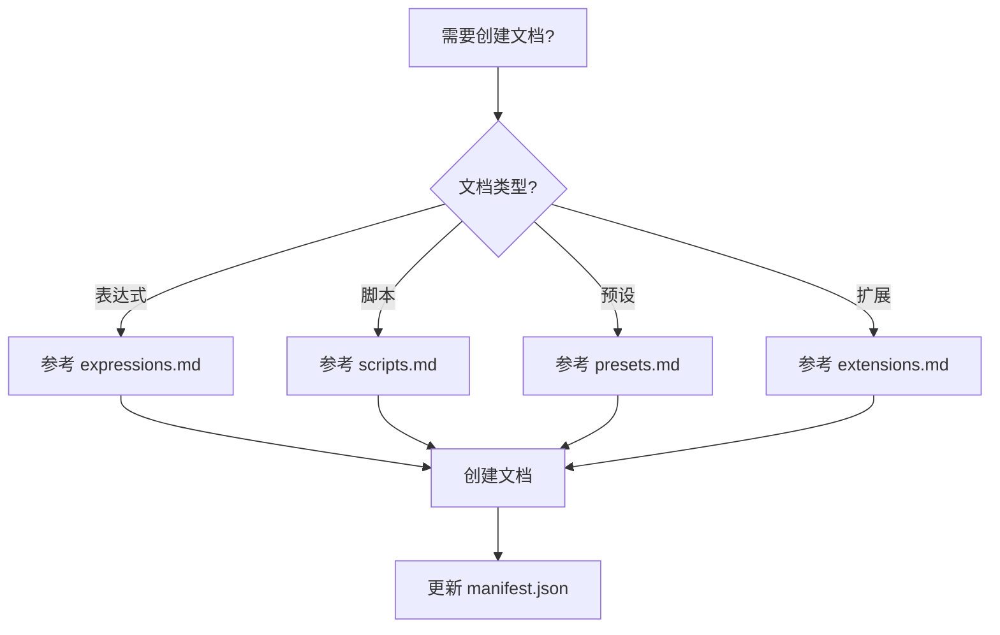

# 文档编写技能

## 概述

为 AE 脚本市场内容系统创建文档。

**核心规则：**
- 统一的元数据格式
- 正确的目录和图片路径
- 网络地址作为下载链接
- 更新对应的 manifest.json
- 支持封面图片和收藏功能

**必需前置技能：** 使用 `superpowers:test-driven-development` 确保文档质量

## 工作流程



## 标准元数据（必须）

所有文档必须包含以下 YAML 前置元数据：

```yaml
---
title: 文档标题
author: 烟囱鸭
tags: [标签1, 标签2, 标签3]
description: 简短副标题
updatedAt: YYYY-MM-DD
isFavorite: false  # 可选，默认 false
coverImage: https://example.com/cover.jpg  # 可选
---
```

**元数据说明**：
- `title`：文档标题（必填）
- `author`：作者（必填）
- `tags`：标签数组（必填）
- `description`：简短描述（必填）
- `updatedAt`：更新日期（必填，格式：YYYY-MM-DD）
- `isFavorite`：收藏标记（可选，布尔值，默认 false）
- `coverImage`：封面图片 URL（可选）

**注意**：
- ❌ 不再使用 `iconEmoji` 字段
- ❌ 不再使用 `category` 字段（由文件所在目录决定）

## 目录结构

```
public/content/
├── expressions/
│   ├── manifest.json
│   ├── *.md
│   └── assets/          # 图片资源
├── scripts/
│   ├── manifest.json
│   ├── *.md
│   └── assets/
├── presets/
│   ├── manifest.json
│   ├── *.md
│   └── assets/
└── extensions/
    ├── manifest.json
    ├── *.md
    └── assets/
```

## 子文档

- **expressions.md** - 表达式文档要点
- **scripts.md** - 脚本文档要点
- **presets.md** - 预设文档要点
- **extensions.md** - 扩展文档要点
- **shared/image-resources.md** - 图片资源管理
- **shared/download-links.md** - 下载链接规范
- **shared/cover-guide.md** - 封面使用指南
- **examples/** - 文档示例（参考）

## 重要注意事项

### 1. 图片引用

**只引用实际存在的图片：**
- 不要添加不存在的图片链接
- 如果没有实际图片，使用文字描述代替
- 图片路径格式：`./assets/filename.png`

### 2. 相关文档链接

**链接格式（前端路由）：**
```markdown
✅ [文档名称](./document-name)   # 不包含 .md
❌ [文档名称](./document-name.md) # 包含 .md 会导致无法打开
```

**只引用实际存在的文档：**
- 表达式：检查 `public/content/expressions/manifest.json`
- 脚本：检查 `public/content/scripts/manifest.json`
- 预设：检查 `public/content/presets/manifest.json`
- 扩展：检查 `public/content/extensions/manifest.json`

### 3. 封面图片

**封面优先级：**
1. 自定义封面 (`coverImage`)
2. 自动生成封面（基于标题和描述）
3. 占位符

**自动生成封面：**
- 如果不设置 `coverImage`，系统会自动生成默认封面
- 封面会显示标题和描述
- 使用蓝色渐变背景和终端风格

**封面尺寸：**
- 自动生成：640×360（16:9 比例）
- 自定义：建议使用 16:9 比例
- 支持常见格式：JPG、PNG、GIF、WebP

### 4. 收藏功能

**使用场景：**
- 推荐文章设置为收藏
- 收藏文章会优先显示在列表和首页推荐
- 收藏文章会显示星星图标

## 核心规则（必须）

### 1. 图片路径

**规则：** 图片使用相对路径 `./assets/filename.png`

```markdown
✅ 
❌ 
```

### 2. 下载链接

**规则：** 使用网络地址，不使用本地路径

```markdown
✅ 🔗 [下载](https://github.com/.../file.ext)
❌ 🔗 [下载](/downloads/file.ext)
```

### 3. 清单更新

**规则：** 在对应目录的 `manifest.json` 数组中添加文件名

```json
["existing-doc.md", "new-doc.md"]
```

### 4. 元数据格式

**规则：** 使用最新的元数据格式

```yaml
---
title: 标题
author: 作者
tags: [标签]
description: 描述
updatedAt: 2026-03-19
isFavorite: false
coverImage: https://example.com/cover.jpg
---
```

## 快速参考

| 文档类型 | 参考文档 | 示例文件 |
|----------|----------|----------|
| 表达式 | expressions.md | examples/expression-template.md |
| 脚本 | scripts.md | examples/script-template.md |
| 预设 | presets.md | examples/preset-template.md |
| 扩展 | extensions.md | examples/extension-template.md |

## 参考资源

- **shared/image-resources.md** - 图片资源管理
- **shared/download-links.md** - 下载链接规范
- **shared/cover-guide.md** - 封面使用指南
- **examples/** - 文档示例（参考，非模板）

## 质量检查（必须）

- [ ] 元数据包含所有 5 个必需字段（title, author, tags, description, updatedAt）
- [ ] 元数据格式正确（移除 iconEmoji 和 category）
- [ ] 文件保存在正确的 `public/content/{模块类型}/` 目录
- [ ] 下载链接使用网络地址
- [ ] 图片使用相对路径 `./assets/`
- [ ] 已更新对应的 `manifest.json`
- [ ] 封面图片 URL 有效（如果设置了 coverImage）
- [ ] isFavorite 为布尔值（如果设置了 isFavorite）

## 参考示例

查看现有文档：
- `public/content/expressions/auto-keyframe.md`
- `public/content/scripts/script-complete-guide.md`
- `public/content/presets/animation.md`
- `public/content/extensions/extension-dev-guide.md`

## 版本更新

**v2.0 (2026-03-19)**：
- 移除 `iconEmoji` 字段
- 移除 `category` 字段
- 添加 `isFavorite` 字段支持收藏功能
- 添加 `coverImage` 字段支持封面图片
- 实现自动生成默认封面功能
- 更新所有模板和指南文档