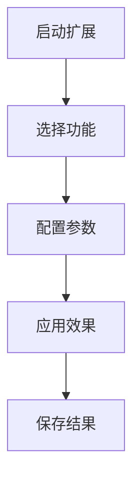

## 下载

🔗 [下载扩展](https://github.com/yancongya/AE----/releases/download/v1.0.0/extension-name.zxp)

**文件信息：**
- 文件大小：2.5 MB
- 版本：v1.0.0
- 兼容性：AE CC 2019+
- 类型：扩展插件

## 功能描述

[详细描述扩展的功能和价值]

## 核心特性

### 特性 1

[详细说明特性 1 的功能和用法]

### 特性 2

[详细说明特性 2 的功能和用法]

### 特性 3

[详细说明特性 3 的功能和用法]

## 安装方法

### 方法 1：CC 扩展管理器

1. 打开 Creative Cloud 桌面应用程序
2. 选择"Exchange"选项卡
3. 搜索扩展名称
4. 点击安装

### 方法 2：手动安装

1. 下载 .zxp 文件
2. 使用 ZXPInstaller 安装
3. 重启 After Effects

## 使用方法

### 界面介绍

### 操作流程

1. 启动扩展：Window → 扩展名称
2. 配置参数
3. 应用功能
4. 保存结果

### 工作流程图

## 界面展示

## 参数配置

| 参数 | 说明 | 范围 | 默认值 |
|------|------|------|--------|
| 参数1 | 说明 | 0-100 | 50 |
| 参数2 | 说明 | 列表 | 选项1 |

## 快捷键

| 快捷键 | 功能 |
|--------|------|
| Ctrl+1 | 功能1 |
| Ctrl+2 | 功能2 |

## 注意事项

> ⚠️ **注意**：重要的使用提示和限制

## 常见问题

### Q: 问题 1？

**A:** 详细解答

### Q: 问题 2？

**A:** 详细解答

## 系统要求

- 操作系统：Windows 10+ / macOS 10.14+
- After Effects：CC 2019 或更高版本
- 内存：8GB 以上推荐
- 磁盘空间：100MB 可用空间

## 相关资源

- [官方文档](https://example.com/docs)
- [视频教程](https://example.com/tutorial)
- [社区讨论](https://example.com/community)

## 更新日志

- v1.0.0 (2026-03-19)：初始版本