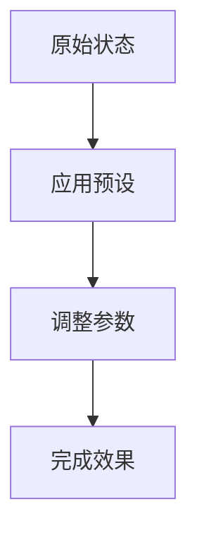

## 下载

🔗 [下载预设](https://github.com/yancongya/AE----/releases/download/v1.0.0/preset-name.ffx)

**文件信息：**
- 文件大小：500 KB
- 版本：v1.0.0
- 兼容性：AE CC 2019+
- 类型：动画预设

## 功能描述

[详细描述预设的功能和效果]

## 使用场景

- 场景 1：详细描述和效果
- 场景 2：详细描述和效果
- 场景 3：详细描述和效果

## 使用方法

### 步骤 1：安装

1. 下载预设文件
2. 复制到 AE 预设目录
3. 重启 After Effects

### 步骤 2：应用

1. 选择图层
2. 打开 Effects & Presets 面板
3. 搜索预设名称
4. 双击应用

### 步骤 3：调整

1. 在效果控件面板调整参数
2. 实时预览效果
3. 根据需要微调

## 参数说明

| 参数 | 说明 | 范围 | 默认值 |
|------|------|------|--------|
| 参数1 | 说明 | 0-100 | 50 |
| 参数2 | 说明 | 0-1 | 0.5 |

## 效果演示

## 可视化说明

## 注意事项

> ⚠️ **注意**：重要的使用提示和限制

## 常见问题

### Q: 问题 1？

**A:** 详细解答

### Q: 问题 2？

**A:** 详细解答

## 相关预设

- [相关预设1](./related-preset1)
- [相关预设2](./related-preset2)

## 更新日志

- v1.0.0 (2026-03-19)：初始版本